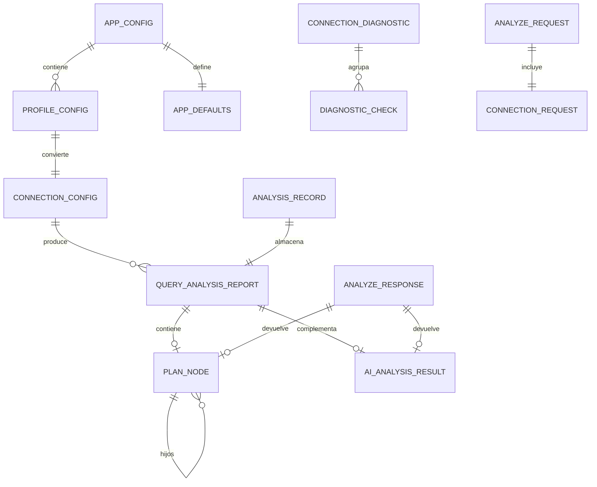

<div align="center">


**UNIVERSIDAD PRIVADA DE TACNA**

**FACULTAD DE INGENIERÍA**

**Escuela Profesional de Ingeniería de Sistemas**

<br>

# DICCIONARIO DE DATOS

## PROYECTO: ANALIZADOR DE RENDIMIENTO DE CONSULTAS

**Sistema Query Analyzer**

<br>

**Curso:** Base de Datos II

**Docente:** Mag. Patrick Cuadros Quiroga

**Integrantes:**

**Carbajal Vargas, Andre Alejandro (2023077287)**

**Yupa Gómez, Fátima Sofía (2023076618)**

<br>

**Tacna – Perú**

**2026**

</div>

<div style="page-break-after: always;"></div>

# CONTROL DE VERSIONES

| Versión | Elaborado por | Revisado por | Fecha | Motivo |
|:---:|---|---|:---:|---|
| 1.0 | AACV / FSYG | AACV / FSYG | 23/06/2026 | Diccionario lógico y físico local de Query Analyzer 2.3.1 |

# 1. Introducción

Query Analyzer no utiliza una base de datos relacional central para almacenar su información. La
persistencia propia del sistema se compone de:

- un archivo YAML de configuración;
- archivos JSON de historial por perfil;
- modelos Pydantic y dataclasses en memoria;
- contratos JSON de la API REST;
- datos temporales entregados por los motores analizados.

Por ello, este diccionario documenta tanto las estructuras persistidas como los modelos de dominio y
los contratos de intercambio. No describe las tablas internas de las bases de datos del usuario,
porque estas pertenecen a sistemas externos y varían en cada análisis.

# 2. Convenciones

| Símbolo | Significado |
|---|---|
| Sí | Campo obligatorio |
| No | Campo opcional |
| Cond. | Obligatorio según motor o contexto |
| UTC | Fecha y hora en Tiempo Universal Coordinado |
| JSON | Objeto o valor serializable |
| Secreto | Dato que no debe mostrarse ni registrarse en texto plano |

# 3. Mapa de estructuras



# 4. Persistencia local

## 4.1. Archivo de configuración

| Atributo | Valor |
|---|---|
| Ruta por defecto | `~/.query-analyzer/config.yaml` |
| Ruta alternativa | Variable `QA_CONFIG_PATH` |
| Formato | YAML UTF-8 |
| Permisos esperados | Directorio `0700`, archivo `0600` cuando el SO lo permite |
| Contenido | Perfiles, valores por defecto y perfil activo |
| Protección | Contraseñas cifradas antes de guardar |

### Ejemplo lógico

```yaml
profiles:
  local-postgres:
    engine: postgresql
    host: localhost
    port: 5432
    database: query_analyzer
    username: postgres
    password: "ENC[...]"
    extra: {}
defaults:
  slow_query_threshold_ms: 1000
  explain_format: json
  output_format: rich
default_profile: local-postgres
```

## 4.2. Historial

| Atributo | Valor |
|---|---|
| Ruta | `~/.query-analyzer/history/` |
| Archivo | `<perfil_sanitizado>.json` |
| Formato | Lista JSON |
| Límite por defecto | 100 registros por perfil |
| Escritura | Archivo temporal y reemplazo atómico |
| Recuperación | Un archivo corrupto se renombra a `.broken-<fecha>.json` |

## 4.3. Datos no persistidos

- Contraseñas recibidas por API.
- API keys de proveedores de IA.
- Conexiones activas.
- Objetos nativos de drivers.
- Datos completos de las tablas o colecciones consultadas, salvo que aparezcan en el plan devuelto
  por el motor.

# 5. Modelos de configuración

## 5.1. `ProfileConfig`

Representa un perfil guardado en YAML.

| Campo | Tipo | Obligatorio | Regla / descripción |
|---|---|:---:|---|
| `engine` | `str` | Sí | Motor soportado, normalizado a minúsculas |
| `host` | `str \| null` | Cond. | Host del servidor; no requerido para SQLite |
| `port` | `int \| null` | No | Rango de 1 a 65535 |
| `database` | `str` | Cond. | Nombre, ruta o espacio lógico según motor |
| `username` | `str \| null` | No | Usuario de autenticación |
| `password` | `str \| null` | No | Se cifra al persistir |
| `extra` | `dict[str, Any]` | No | Propiedades particulares del motor |

Motores admitidos por este modelo: PostgreSQL, MySQL, SQLite, MongoDB, Redis, CockroachDB,
YugabyteDB, Neo4j, InfluxDB, Elasticsearch y Microsoft SQL Server.

## 5.2. `AppDefaults`

| Campo | Tipo | Obligatorio | Valor por defecto | Regla |
|---|---|:---:|---|---|
| `slow_query_threshold_ms` | `int` | Sí | `1000` | Mayor o igual a cero |
| `explain_format` | `str` | Sí | `json` | `json` o `text` |
| `output_format` | `str` | Sí | `rich` | `rich`, `plain` o `json` |

## 5.3. `AppConfig`

| Campo | Tipo | Obligatorio | Descripción |
|---|---|:---:|---|
| `profiles` | `dict[str, ProfileConfig]` | Sí | Perfiles indexados por nombre único |
| `defaults` | `AppDefaults` | Sí | Preferencias generales |
| `default_profile` | `str \| null` | No | Nombre de un perfil existente |

## 5.4. `ConnectionConfig`

Modelo de ejecución construido a partir de un perfil o solicitud.

| Campo | Tipo | Obligatorio | Regla / descripción |
|---|---|:---:|---|
| `engine` | `str` | Sí | Uno de los 13 motores reconocidos |
| `host` | `str \| null` | Cond. | Se eliminan espacios; vacío no permitido |
| `port` | `int \| null` | No | Se asignan puertos por defecto cuando aplica |
| `database` | `str` | Cond. | Puede estar vacío en Redis, Cassandra, DynamoDB y Elasticsearch |
| `username` | `str \| null` | No | Vacío no permitido si se proporciona |
| `password` | `str \| null` | No | Vacío permitido en SQLite y CockroachDB |
| `extra` | `dict[str, Any]` | No | `authSource`, SSL, región, endpoint u otras opciones |

### Puertos por defecto

| Motor | Puerto |
|---|---:|
| PostgreSQL | 5432 |
| MySQL | 3306 |
| Microsoft SQL Server | 1433 |
| MongoDB | 27017 |
| Redis | 6379 |
| Neo4j | 7687 |
| Elasticsearch | 9200 |

# 6. Modelos de análisis

## 6.1. `PlanNode`

Nodo recursivo y agnóstico del plan.

| Campo | Tipo | Obligatorio | Descripción |
|---|---|:---:|---|
| `node_type` | `str` | Sí | Operación: Seq Scan, Index Scan, Join, COLLSCAN, etc. |
| `cost` | `float \| null` | No | Costo estimado por el optimizador |
| `estimated_rows` | `int \| null` | No | Filas estimadas |
| `actual_rows` | `int \| null` | No | Filas observadas |
| `actual_time_ms` | `float \| null` | No | Tiempo observado del nodo |
| `children` | `list[PlanNode]` | Sí | Nodos descendientes; lista vacía por defecto |
| `properties` | `dict[str, Any]` | Sí | Propiedades específicas del motor |

Reglas:

- `node_type` no puede estar vacío.
- Los campos no disponibles permanecen como `null`.
- `properties` no debe utilizarse para guardar secretos.

## 6.2. `AIAnalysisResult`

| Campo | Tipo | Obligatorio | Descripción |
|---|---|:---:|---|
| `summary` | `str` | Sí | Resumen en lenguaje natural |
| `observations` | `list[str]` | Sí | Observaciones puntuales |
| `recommendations` | `list[str]` | Sí | Acciones sugeridas |
| `suggested_query` | `str \| null` | No | Consulta alternativa propuesta |
| `raw_response` | `str \| null` | No | Respuesta original para diagnóstico |

Reglas:

- `summary` no puede estar vacío.
- Es interpretación asistida, no dato factual.
- No puede sobrescribir métricas del reporte.

## 6.3. `QueryAnalysisReport`

| Campo | Tipo | Obligatorio | Descripción |
|---|---|:---:|---|
| `engine` | `str` | Sí | Motor que ejecutó el análisis |
| `query` | `str` | Sí | Consulta original |
| `execution_time_ms` | `float` | Sí | Tiempo total; debe ser mayor que cero |
| `plan_tree` | `PlanNode \| null` | No | Plan normalizado |
| `plan_summary` | `str` | Sí | Resumen factual simple |
| `ai_analysis` | `AIAnalysisResult \| null` | No | Interpretación opcional |
| `analyzed_at` | `datetime` | Sí | Fecha UTC |
| `raw_plan` | `dict[str, Any] \| null` | No | Plan original del motor |
| `metrics` | `dict[str, Any]` | Sí | Métricas específicas |

Reglas:

- `engine` se normaliza a minúsculas.
- `execution_time_ms` debe ser positivo.
- `raw_plan` se conserva para trazabilidad.
- No existen campos `score`, `warnings` deterministas ni antipatrones universales en el contrato
  actual.

# 7. Historial

## 7.1. `AnalysisRecord`

| Campo | Tipo | Obligatorio | Descripción |
|---|---|:---:|---|
| `query` | `str` | Sí | Consulta analizada |
| `report` | `QueryAnalysisReport` | Sí | Reporte completo |
| `profile_name` | `str` | Sí | Perfil utilizado |
| `created_at` | `datetime` | Sí | Fecha UTC del registro |
| `notes` | `str` | Sí | Nota del usuario; vacía por defecto |
| `id` | `str` derivado | Sí | ISO 8601 de `created_at` |

### Representación JSON

```json
{
  "query": "SELECT 1",
  "report": {
    "engine": "sqlite",
    "query": "SELECT 1",
    "execution_time_ms": 0.15,
    "plan_tree": null,
    "plan_summary": "Constant row",
    "ai_analysis": null,
    "analyzed_at": "2026-06-23T12:00:00Z",
    "raw_plan": {},
    "metrics": {}
  },
  "profile_name": "local-sqlite",
  "created_at": "2026-06-23T12:00:00Z",
  "notes": ""
}
```

# 8. Diagnóstico de conexiones

## 8.1. `DiagnosticCheck`

| Campo | Tipo | Obligatorio | Valores / descripción |
|---|---|:---:|---|
| `name` | `str` | Sí | Nombre de la comprobación |
| `status` | `str` | Sí | `success`, `failed` o `skipped` |
| `message` | `str` | Sí | Resultado sin secretos |
| `duration_ms` | `float` | Sí | Duración de la comprobación |

## 8.2. `ConnectionDiagnostic`

| Campo | Tipo | Obligatorio | Descripción |
|---|---|:---:|---|
| `profile_name` | `str` | Sí | Perfil diagnosticado |
| `engine` | `str` | Sí | Motor |
| `endpoint` | `str` | Sí | `host:port` o ruta SQLite |
| `status` | `str` | Sí | Estado agregado |
| `checks` | `list[DiagnosticCheck]` | Sí | Comprobaciones ordenadas |
| `duration_ms` | `float` | Sí | Duración total |
| `checked_at` | `datetime` | Sí | Fecha UTC |
| `safe_message` | `str` | Sí | Mensaje público |
| `technical_detail` | `str \| null` | No | Detalle sanitizado |

### Estados agregados

| Estado | Significado |
|---|---|
| `connected` | Conexión y operación básica exitosas |
| `service_unreachable` | Host o puerto inaccesible |
| `authentication_failed` | Credenciales inválidas |
| `database_missing` | Base de datos o espacio inexistente |
| `timeout` | Tiempo de espera agotado |
| `configuration_error` | Configuración incompleta o inválida |
| `unknown_error` | Error no clasificado |

### Comprobaciones estándar

1. Validación de configuración.
2. Conectividad de red TCP.
3. Autenticación y driver.
4. Consulta de operatividad.

# 9. Contratos de la API REST

## 9.1. `ConnectionRequest`

| Campo | Tipo | Obligatorio | Descripción |
|---|---|:---:|---|
| `engine` | `str` | Sí | Motor |
| `host` | `str \| null` | No | Host o IP |
| `port` | `int \| null` | No | Puerto |
| `username` | `str \| null` | No | Usuario |
| `password` | `SecretStr \| null` | No | Contraseña no serializable en claro |
| `database` | `str` | Sí | Nombre o ruta; vacío por defecto |
| `auth_database` | `str \| null` | No | Base de autenticación |
| `ssl` | `bool` | Sí | `false` por defecto |

## 9.2. `AnalyzeRequest`

| Campo | Tipo | Obligatorio | Descripción |
|---|---|:---:|---|
| `connection` | `ConnectionRequest` | Sí | Conexión temporal |
| `query` | `str` | Sí | Consulta |
| `include_ai` | `bool` | Sí | `false` por defecto |

## 9.3. `AnalyzeResponse`

| Campo | Tipo | Obligatorio | Descripción |
|---|---|:---:|---|
| `success` | `bool` | Sí | Resultado |
| `engine` | `str` | Sí | Motor |
| `query` | `str` | Sí | Consulta |
| `execution_time_ms` | `float \| null` | No | Tiempo |
| `plan_tree` | `PlanNode \| null` | No | Plan normalizado |
| `plan_summary` | `str \| null` | No | Resumen |
| `ai_analysis` | `AIAnalysisResult \| null` | No | IA opcional |
| `analyzed_at` | `datetime \| null` | No | Fecha |
| `raw_plan` | `Any` | No | Plan original |
| `metrics` | `dict[str, Any]` | Sí | Métricas |
| `error` | `str \| null` | No | Mensaje seguro |

## 9.4. IA

### `AIConfigRequest`

| Campo | Tipo | Obligatorio | Descripción |
|---|---|:---:|---|
| `base_url` | `str` | Sí | URL del proveedor |
| `api_key` | `SecretStr` | Sí | Clave temporal |
| `model` | `str` | Sí | `gpt-4o` por defecto en el esquema |

### `AIAnalyzeRequest`

| Campo | Tipo | Obligatorio | Descripción |
|---|---|:---:|---|
| `plan_json` | `Any` | Sí | Plan a interpretar |
| `query` | `str` | Sí | Consulta |
| `engine` | `str` | Sí | Motor |
| `ai_config` | `AIConfigRequest \| null` | No | Configuración explícita |

### `AIAnalyzeResponse`

| Campo | Tipo | Obligatorio | Descripción |
|---|---|:---:|---|
| `success` | `bool` | Sí | Resultado |
| `summary` | `str` | Sí | Resumen |
| `observations` | `list[str]` | Sí | Observaciones |
| `recommendations` | `list[str]` | Sí | Recomendaciones |
| `suggested_query` | `str \| null` | No | Consulta propuesta |
| `error` | `str \| null` | No | Mensaje seguro |

## 9.5. Métricas y operaciones lentas

### `MetricsRequest`

| Campo | Tipo | Obligatorio |
|---|---|:---:|
| `connection` | `ConnectionRequest` | Sí |

### `SlowQueriesRequest`

| Campo | Tipo | Obligatorio | Regla |
|---|---|:---:|---|
| `connection` | `ConnectionRequest` | Sí | Conexión temporal |
| `threshold_ms` | `int` | Sí | Por defecto 1000; mínimo 1 |

### `MetricsResponse`

| Campo | Tipo | Obligatorio |
|---|---|:---:|
| `success` | `bool` | Sí |
| `metrics` | `dict[str, Any]` | Sí |
| `error` | `str \| null` | No |

### `EngineInfoResponse`

| Campo | Tipo | Obligatorio |
|---|---|:---:|
| `success` | `bool` | Sí |
| `info` | `dict[str, Any]` | Sí |
| `error` | `str \| null` | No |

# 10. Endpoints

| Método | Ruta completa | Entrada | Salida |
|---|---|---|---|
| GET | `/api/v1/analyzer/engines` | Ninguna | Lista de motores |
| POST | `/api/v1/analyzer/explain` | `AnalyzeRequest` | `AnalyzeResponse` |
| POST | `/api/v1/analyzer/ai` | `AIAnalyzeRequest` | `AIAnalyzeResponse` |
| POST | `/api/v1/analyzer/metrics` | `MetricsRequest` | `MetricsResponse` |
| POST | `/api/v1/analyzer/slow-queries` | `SlowQueriesRequest` | Objeto JSON |
| POST | `/api/v1/analyzer/engine-info` | `MetricsRequest` | `EngineInfoResponse` |

# 11. Diccionario de métricas comunes

Las métricas dependen del motor. Los siguientes nombres representan conceptos frecuentes, pero no
se garantiza su presencia en todos los reportes.

| Métrica | Tipo esperado | Significado |
|---|---|---|
| `node_count` | `int` | Cantidad de nodos del plan |
| `execution_time_ms` | `float` | Tiempo observado |
| `planning_time_ms` | `float` | Tiempo de planificación |
| `estimated_rows` | `int` | Filas estimadas |
| `actual_rows` | `int` | Filas observadas |
| `buffers_hit` | `int` | Bloques encontrados en caché |
| `buffers_read` | `int` | Bloques leídos |
| `index_scans` | `int` | Operaciones mediante índice |
| `collection_scans` | `int` | Exploraciones completas |
| `documents_examined` | `int` | Documentos inspeccionados |
| `documents_returned` | `int` | Documentos retornados |
| `transformation_count` | `int` | Transformaciones en pipeline |
| `bucket` | `str` | Bucket de series de tiempo |
| `operation_type` | `str` | Tipo de operación |

Regla fundamental: la ausencia de una métrica no significa valor cero.

# 12. Reglas de integridad y seguridad

1. Los nombres de perfil son únicos dentro de `AppConfig`.
2. `default_profile` debe referenciar un perfil existente.
3. Las contraseñas se cifran antes de escribir el YAML.
4. Los secretos se ocultan en logs, errores y respuestas.
5. Los puertos deben pertenecer al rango 1–65535.
6. `execution_time_ms` debe ser mayor que cero en `QueryAnalysisReport`.
7. `node_type` y el resumen de IA no pueden estar vacíos.
8. El historial se limita por perfil.
9. Las fechas persistidas deben conservar zona horaria.
10. La respuesta de IA no altera los campos factuales.
11. `raw_plan` debe conservarse cuando el motor lo proporcione.
12. Los diccionarios `extra`, `properties` y `metrics` no deben contener secretos.

# 13. Trazabilidad con el código

| Estructura | Archivo |
|---|---|
| `ConnectionConfig`, `PlanNode`, `AIAnalysisResult`, `QueryAnalysisReport` | `query_analyzer/adapters/models.py` |
| `ProfileConfig`, `AppDefaults`, `AppConfig` | `query_analyzer/config/models.py` |
| Persistencia YAML | `query_analyzer/config/manager.py` |
| Cifrado | `query_analyzer/config/crypto.py` |
| `DiagnosticCheck`, `ConnectionDiagnostic` | `query_analyzer/core/connection_diagnostics.py` |
| `AnalysisRecord`, `HistoryManager` | `query_analyzer/tui/history_manager.py` |
| Contratos REST | `query_analyzer/api/schemas.py` |
| Rutas REST | `query_analyzer/api/router.py` |
| Serialización | `query_analyzer/adapters/serializer.py` |
