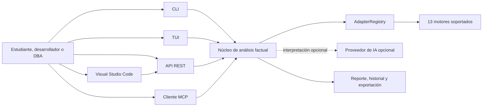
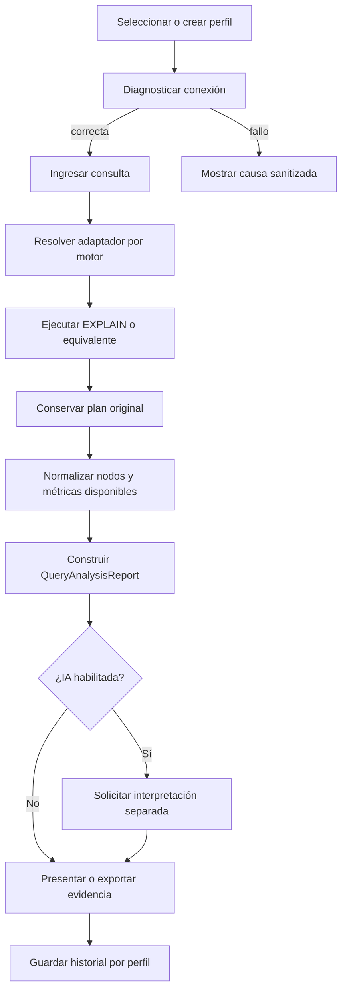

**UNIVERSIDAD PRIVADA DE TACNA**

**FACULTAD DE INGENIERÍA**

**Escuela Profesional de Ingeniería de Sistemas**

**Informe de Visión**

**Sistema Analizador de Rendimiento de Consultas (Query Analyzer)**

Curso: *Base de Datos II*

Docente: *Patrick Cuadros Quiroga*

Integrantes:

***Carbajal Vargas, Andre Alejandro (2023077287)***

***Yupa Gómez, Fátima Sofía (2023076618)***

**Tacna - Perú**

***2026***

\pagebreak

Sistema *Analizador de Rendimiento de Consultas (Query Analyzer)*

Informe de Visión

Versión *1.2*

| CONTROL DE VERSIONES | | | | | |
|:---:|:---|:---|:---|:---:|:---|
| Versión | Hecha por | Revisada por | Aprobada por | Fecha | Motivo |
| 1.0 | ACV, FYG | ACV, FYG | P. Cuadros Q. | 2026-04-04 | Versión inicial |
| 1.1 | ACV, FYG | ACV, FYG | P. Cuadros Q. | 2026-06-23 | Actualización factual y formato institucional |
| 1.2 | ACV, FYG | ACV, FYG | P. Cuadros Q. | 2026-07-04 | Reconstrucción integral conforme al producto 2.3.3 |

\pagebreak

# ÍNDICE GENERAL

1. [Introducción](#1-introduccion)
   1.1. [Propósito](#11-proposito)
   1.2. [Alcance](#12-alcance)
   1.3. [Definiciones, siglas y abreviaturas](#13-definiciones-siglas-y-abreviaturas)
   1.4. [Referencias internas](#14-referencias-internas)
   1.5. [Visión general](#15-vision-general)
2. [Posicionamiento](#2-posicionamiento)
   2.1. [Oportunidad](#21-oportunidad)
   2.2. [Definición del problema](#22-definicion-del-problema)
   2.3. [Posición del producto](#23-posicion-del-producto)
3. [Descripción de interesados y usuarios](#3-descripcion-de-interesados-y-usuarios)
   3.1. [Resumen de interesados](#31-resumen-de-interesados)
   3.2. [Resumen de usuarios](#32-resumen-de-usuarios)
   3.3. [Entorno de usuario](#33-entorno-de-usuario)
   3.4. [Necesidades](#34-necesidades-de-interesados-y-usuarios)
4. [Vista general del producto](#4-vista-general-del-producto)
   4.1. [Perspectiva](#41-perspectiva-del-producto)
   4.2. [Contexto](#42-contexto-del-producto)
   4.3. [Capacidades](#43-resumen-de-capacidades)
   4.4. [Suposiciones y dependencias](#44-suposiciones-y-dependencias)
   4.5. [Costos y distribución](#45-costos-distribucion-y-licenciamiento)
5. [Características del producto](#5-caracteristicas-del-producto)
6. [Restricciones](#6-restricciones)
7. [Rangos de calidad](#7-rangos-de-calidad)
8. [Precedencia y prioridad](#8-precedencia-y-prioridad)
9. [Otros requerimientos del producto](#9-otros-requerimientos-del-producto)
10. [Conclusiones](#10-conclusiones)
11. [Recomendaciones](#11-recomendaciones)
12. [Bibliografía](#12-bibliografia)
13. [Webgrafía](#13-webgrafia)

\pagebreak

# 1. Introducción

## 1.1. Propósito

El presente documento establece la visión funcional, operativa y académica del **Sistema Analizador
de Rendimiento de Consultas (Query Analyzer)**. Su finalidad es proporcionar una referencia común
para el equipo desarrollador, el docente evaluador, los usuarios técnicos y los futuros
mantenedores del proyecto.

La visión define el problema, los usuarios, la propuesta de valor, las capacidades, los límites y
las prioridades de evolución, vinculándolos con evidencias del repositorio.

Este informe describe el producto en su versión **2.3.3**. Cuando se mencionan capacidades futuras,
se identifican expresamente como parte de la hoja de ruta para evitar confundir una aspiración con
una funcionalidad ya implementada.

## 1.2. Alcance

Query Analyzer obtiene evidencia sobre consultas en motores SQL, NoSQL, de grafos, búsqueda y
series temporales mediante un contrato común de adaptadores.

### Alcance funcional incluido

- Crear, editar, probar, seleccionar y eliminar perfiles de conexión.
- Proteger las contraseñas persistidas mediante cifrado local.
- Diagnosticar configuración, red, autenticación y operatividad de una conexión.
- Ejecutar `EXPLAIN`, `SHOWPLAN_XML` o mecanismos equivalentes según el motor.
- Conservar el plan original y construir una representación normalizada cuando sea posible.
- Presentar tiempos, filas, costos, métricas generales y operaciones lentas cuando están disponibles.
- Mostrar y exportar resultados mediante CLI, TUI, API REST, MCP y Visual Studio Code.
- Mantener reportes e historial local por perfil.
- Solicitar una interpretación opcional a un proveedor de inteligencia artificial compatible.

### Motores reconocidos

| Categoría | Motores |
|---|---|
| SQL | PostgreSQL, MySQL, SQLite, Microsoft SQL Server, CockroachDB y YugabyteDB |
| NoSQL y caché | MongoDB, Redis, DynamoDB y Cassandra |
| Búsqueda | Elasticsearch |
| Grafos | Neo4j |
| Series temporales | InfluxDB |

El registro y el modelo de conexión reconocen **13 motores**. La profundidad de las métricas no es
idéntica, porque cada producto ofrece mecanismos de análisis diferentes.

### Fuera de alcance

- Modificar automáticamente esquemas, índices o consultas en una base de datos del usuario.
- Ejecutar una recomendación de IA sin revisión y autorización humana.
- Garantizar que una reescritura propuesta mejore el rendimiento en todos los contextos.
- Sustituir plataformas de observabilidad continua, APM o monitoreo de producción.
- Inventar métricas ausentes o convertirlas en cero.
- Producir una puntuación universal de rendimiento aplicable a motores heterogéneos.
- Comparar directamente costos internos que no tienen la misma semántica entre motores.

## 1.3. Definiciones, siglas y abreviaturas

| Término | Definición |
|---|---|
| API | Interfaz de programación de aplicaciones |
| CLI | Interfaz de línea de comandos |
| TUI | Interfaz de usuario ejecutada dentro de una terminal |
| DBA | Administrador de base de datos |
| MCP | Model Context Protocol, protocolo para exponer herramientas a agentes compatibles |
| Plan de ejecución | Estructura de operaciones elegida por un motor para resolver una consulta |
| `EXPLAIN` | Comando o mecanismo que permite inspeccionar un plan de ejecución |
| Adaptador | Componente que encapsula la comunicación y particularidades de un motor |
| Plan original | Respuesta sin pérdida recibida del motor |
| Plan normalizado | Representación común construida para facilitar la visualización |
| Métrica factual | Valor observado o estimado que procede del motor |
| IA asistiva | Interpretación opcional separada de los datos factuales |
| Perfil | Configuración reutilizable de conexión a un motor |

## 1.4. Referencias internas

- [README principal](../README.md): instalación, motores y formas de uso.
- [FD01 - Informe de Factibilidad](FD01-Informe-Factibilidad.md): viabilidad del proyecto.
- [FD03 - Especificación de Requerimientos](FD03-EPIS-Informe%20Especificación%20Requerimientos.md):
  requisitos y criterios de aceptación.
- [FD04 - Arquitectura de Software](FD04-EPIS-Informe%20Arquitectura%20de%20Software.md):
  componentes y decisiones estructurales.
- [FD05 - Informe Final](FD05-EPIS-Informe%20ProyectoFinal.md): desarrollo y resultados.
- [Manual de Usuario](Manual-de-Usuario.md): operación de las interfaces.
- [Calidad y Evidencias](Calidad-y-Evidencias.md): estrategia de pruebas y cobertura.
- [Diccionario de Datos](DICCIONARIO-DE-DATOS.md): modelos persistidos y contratos.

## 1.5. Visión general

Query Analyzer reduce la fragmentación al estudiar consultas en diferentes motores. No reemplaza
al DBA: organiza evidencia para interpretar planes y justificar decisiones.

La propuesta prioriza la fidelidad de los datos sobre diagnósticos universales. Por ello, el reporte
separa el plan y las métricas del motor de cualquier explicación generada mediante IA.

# 2. Posicionamiento

## 2.1. Oportunidad

Las aplicaciones combinan bases relacionales, documentales, cachés, búsqueda, grafos y series
temporales. Sus comandos, drivers y formatos distintos dificultan una práctica uniforme de análisis.

La oportunidad consiste en reunir motores bajo una experiencia consistente que preserve sus
particularidades, ofrezca evidencia académica, reutilice el núcleo desde diversas interfaces y
reduzca la preparación manual de reportes.

## 2.2. Definición del problema

El problema es la **dispersión de herramientas y formatos para inspeccionar consultas**. Trabajar
con varios motores exige aprender clientes distintos y transformar resultados manualmente.

### Causas

- Los planes no comparten un esquema estándar entre productos.
- Algunos motores no poseen un `EXPLAIN` tradicional.
- Los costos, tiempos y contadores tienen semánticas distintas.
- Las credenciales se administran de forma separada en cada cliente.
- La interpretación de un plan requiere experiencia y contexto.

### Consecuencias

- Mayor tiempo de diagnóstico.
- Dificultad para enseñar conceptos comunes sin ocultar diferencias.
- Riesgo de presentar estimaciones como tiempos reales.
- Comparaciones incorrectas entre métricas incompatibles.
- Dependencia de interfaces particulares para obtener información básica.

## 2.3. Posición del producto

Para estudiantes, desarrolladores y administradores que necesitan inspeccionar consultas en
tecnologías heterogéneas, Query Analyzer es una herramienta local de análisis que obtiene planes y
métricas mediante adaptadores y los presenta a través de múltiples interfaces. A diferencia de una
plataforma de monitoreo o de un evaluador basado únicamente en heurísticas, conserva la evidencia
del motor, declara los datos ausentes y mantiene cualquier interpretación de IA como un complemento
opcional.

| Alternativa | Ventaja | Limitación frente a la visión |
|---|---|---|
| Cliente nativo de cada motor | Máxima profundidad específica | Experiencia y formatos fragmentados |
| APM o monitoreo empresarial | Observabilidad continua | Mayor costo y despliegue; propósito distinto |
| Scripts aislados | Flexibilidad inmediata | Poco reutilizables y difíciles de mantener |
| Interpretación manual | Control experto | Requiere tiempo y conocimiento especializado |
| Query Analyzer | Contrato común, operación local y múltiples interfaces | La profundidad depende de cada adaptador |

\pagebreak

# 3. Descripción de interesados y usuarios

## 3.1. Resumen de interesados

| Interesado | Responsabilidad o interés | Criterio de éxito |
|---|---|---|
| Equipo desarrollador | Diseñar, implementar y mantener el producto | Código verificable, documentación coherente y evolución controlada |
| Docente del curso | Orientar y evaluar el proyecto | Correspondencia entre problema, solución, código y evidencias |
| Escuela Profesional | Promover aplicación práctica del conocimiento | Entregable académico reutilizable y bien sustentado |
| Mantenedores futuros | Corregir y ampliar adaptadores e interfaces | Contratos claros, pruebas automatizadas y trazabilidad |
| Comunidad técnica | Usar o estudiar la herramienta | Instalación comprensible y resultados transparentes |

## 3.2. Resumen de usuarios

| Perfil | Objetivo principal | Conocimiento esperado |
|---|---|---|
| Estudiante de bases de datos | Aprender a leer planes y relacionarlos con una consulta | Fundamentos de consultas y terminal |
| Desarrollador | Recopilar evidencia sobre una consulta problemática | Programación y acceso al motor |
| DBA o usuario avanzado | Examinar planes y métricas sin perder el detalle original | Administración y optimización |
| Integrador | Consumir resultados desde scripts, API, MCP o VS Code | Automatización e integración |

La TUI, los resúmenes y la IA opcional apoyan la interpretación, pero no sustituyen la validación
con datos, carga y contexto reales.

## 3.3. Entorno de usuario

- Sistemas de escritorio o servidores compatibles con las distribuciones publicadas.
- Terminal para CLI y TUI.
- Navegador para Swagger UI cuando se inicia la API local.
- Visual Studio Code para el análisis desde el editor.
- Cliente MCP compatible cuando se usa la integración con agentes.
- Acceso de red al motor objetivo y, si corresponde, a servicios externos.

La aplicación trabaja sin IA, pero las conexiones remotas y servicios externos requieren red.

## 3.4. Necesidades de interesados y usuarios

| ID | Necesidad | Respuesta del producto | Prioridad |
|---|---|---|:---:|
| N-01 | Configurar motores sin repetir credenciales | Perfiles locales y selección de perfil | Alta |
| N-02 | Saber por qué falla una conexión | Diagnóstico por etapas con mensajes sanitizados | Alta |
| N-03 | Obtener el plan sin aprender cada cliente | Adaptadores y `AdapterRegistry` | Alta |
| N-04 | Conservar el detalle del motor | Campo de plan original en el reporte | Alta |
| N-05 | Visualizar una estructura común | Árbol de plan normalizado | Alta |
| N-06 | Diferenciar hechos de interpretación | Modelos separados para reporte e IA | Alta |
| N-07 | Automatizar el consumo | JSON, API REST y MCP | Media |
| N-08 | Trabajar desde el editor | Extensión de Visual Studio Code | Media |
| N-09 | Justificar cambios | Exportación e historial por perfil | Media |
| N-10 | Incorporar nuevos motores | Patrón Adapter y pruebas de contrato | Media |

# 4. Vista general del producto

## 4.1. Perspectiva del producto

Query Analyzer es una aplicación local y extensible, no un proxy ni un servidor de monitoreo. El
adaptador consulta el motor y el núcleo produce un `QueryAnalysisReport` reutilizable desde CLI,
TUI, API, MCP y VS Code.

## 4.2. Contexto del producto

## 4.3. Resumen de capacidades

| ID | Capacidad | Estado en 2.3.3 | Evidencia principal |
|---|---|:---:|---|
| CAP-01 | Gestión y cifrado de perfiles | Implementada | `query_analyzer/config/` |
| CAP-02 | Diagnóstico de conexión | Implementada | `core/connection_diagnostics.py` |
| CAP-03 | Registro de 13 motores | Implementada | `adapters/registry.py` y pruebas de contrato |
| CAP-04 | Obtención de planes o mecanismos equivalentes | Implementada según motor | Adaptadores concretos |
| CAP-05 | Plan original y normalización | Implementada | Modelos, parsers y serializador |
| CAP-06 | CLI y TUI | Implementada | `query_analyzer/cli/` y `query_analyzer/tui/` |
| CAP-07 | API REST versionada | Implementada | `/api/v1/analyzer` |
| CAP-08 | Servidor MCP | Implementada | Herramienta `analyze_query` |
| CAP-09 | Extensión de Visual Studio Code | Implementada | `integrations/vscode-query-analyzer/` |
| CAP-10 | Exportación e historial | Implementada | Serializador e historial por perfil |
| CAP-11 | Interpretación mediante IA | Implementada como opción | `core/ai_analyzer.py` |
| CAP-12 | Portal de evidencias | Implementada | GitHub Pages y workflow de calidad |

## 4.4. Suposiciones y dependencias

### Suposiciones

- El usuario cuenta con autorización para conectarse y analizar el motor.
- La consulta es compatible con el lenguaje y versión del motor elegido.
- Las estadísticas internas del motor están razonablemente actualizadas.
- La presencia de un plan no implica que una recomendación sea universalmente válida.
- Los resultados varían según datos, caché, concurrencia y configuración.

### Dependencias técnicas

| Área | Tecnología |
|---|---|
| Lenguaje | Python 3.14 o superior |
| Gestión del entorno | uv y `uv.lock` |
| CLI | Typer y Rich |
| TUI | Textual |
| Modelos | Pydantic |
| API | FastAPI y Uvicorn |
| Agentes | SDK de Model Context Protocol |
| Drivers | Bibliotecas específicas de cada motor |
| Calidad | pytest, Ruff, mypy, Bandit, Semgrep, pip-audit y mutmut |
| Integración | Docker Compose y servicios emulados cuando corresponde |

## 4.5. Costos, distribución y licenciamiento

El repositorio no define un precio comercial. El costo operativo depende de la infraestructura y,
opcionalmente, del proveedor de IA.

| Concepto | Situación actual |
|---|---|
| Uso de Query Analyzer | Sin precio comercial definido |
| Ejecución local | Requiere equipo y acceso al motor |
| Motores Docker de laboratorio | Recursos del equipo anfitrión |
| Proveedor de IA | Opcional; sujeto al proveedor elegido |
| Distribución | GitHub Releases, Homebrew, Scoop, Snap y VSIX |
| Código fuente | Disponible en el repositorio académico |

No existe un archivo `LICENSE` registrado en la revisión actual. Por tanto, el documento no atribuye
una licencia concreta; su selección y publicación quedan como una decisión pendiente del equipo y
de la institución.

\pagebreak

# 5. Características del producto

## 5.1. Perfiles y diagnóstico

El usuario mantiene perfiles reutilizables. Las contraseñas se cifran al persistirse y se ocultan en
mensajes. El diagnóstico diferencia fallos de configuración, red, autenticación y disponibilidad.

## 5.2. Análisis factual

El adaptador obtiene el plan o equivalente. El resultado conserva consulta, motor, fecha, resumen,
árbol normalizado, plan original y métricas disponibles; los campos ausentes permanecen nulos.

## 5.3. Presentación en CLI y TUI

La CLI facilita automatización y salidas estructuradas. La TUI incorpora edición, navegación,
planes, historial y exportación. Ambas reutilizan los mismos modelos.

## 5.4. API REST

La API local, bajo `/api/v1/analyzer`, lista motores, analiza consultas y expone IA, métricas,
operaciones lentas e información del motor. FastAPI genera OpenAPI y valida modelos tipados.

## 5.5. MCP y Visual Studio Code

MCP permite invocar análisis con parámetros estructurados. La extensión de VS Code analiza una
selección SQL desde el editor. Ambas reutilizan el núcleo.

## 5.6. IA opcional

La IA devuelve observaciones y recomendaciones en un campo separado, sin modificar métricas. Si no
está configurada o falla, el reporte factual continúa siendo válido.

## 5.7. Reportes e historial

El reporte se serializa para lectura o automatización. El historial local por perfil permite
recuperar análisis, pero no constituye telemetría centralizada.

# 6. Restricciones

| Restricción | Impacto | Tratamiento |
|---|---|---|
| Heterogeneidad de motores | No existe paridad total de métricas | Contrato común mínimo y propiedades específicas |
| Motores sin `EXPLAIN` tradicional | El análisis puede ser menos profundo | Uso de mecanismos equivalentes y alcance documentado |
| Efectos de `EXPLAIN ANALYZE` | Algunas variantes ejecutan la consulta | Uso controlado y advertencias según adaptador |
| Estadísticas desactualizadas | El optimizador puede producir estimaciones poco representativas | Interpretar el plan dentro de su contexto |
| Credenciales sensibles | Riesgo de exposición | Cifrado, sanitización y exclusión de reportes |
| Servicios externos | IA o motores administrados requieren red | Funcionamiento factual independiente de la IA |
| Drivers opcionales | Algunas plataformas presentan limitaciones de compatibilidad | Instalación y pruebas diferenciadas |
| Cobertura desigual | No todos los motores exponen la misma información | No comparar métricas incompatibles |
| Operación local | No ofrece monitoreo continuo centralizado | Integración con herramientas externas cuando sea necesario |
| Licenciamiento no formalizado | No puede afirmarse una licencia de uso | Publicar una licencia antes de distribución externa formal |

El sistema debe rechazar entradas inválidas con mensajes seguros, no registrar secretos ni
presentar recomendaciones como garantías.

# 7. Rangos de calidad

| Atributo | Criterio vigente | Evidencia |
|---|---|---|
| Correctitud | Cero fallos en las suites obligatorias | pytest unitario, contrato, BDD e integración |
| Cobertura | Umbral mínimo de 65 % en el alcance unitario definido | pytest-cov y Quality Gate |
| Compatibilidad de motores | Los 13 nombres cumplen el contrato común | Pruebas de contrato |
| Tipado | Sin errores en los módulos fuente evaluados | mypy |
| Estilo | Sin incidencias y formato reproducible | Ruff y Ruff Format |
| Seguridad estática | Sin hallazgos de severidad bloqueante | Bandit y Semgrep |
| Dependencias | Auditoría automatizada de dependencias de ejecución | pip-audit y auditoría npm |
| Robustez de pruebas | Evaluación de mutantes detectados y sobrevivientes | mutmut |
| Interfaz | Navegación documental y vista móvil verificadas | Playwright |
| Reproducibilidad | Dependencias resueltas mediante archivo de bloqueo | uv y `uv.lock` |
| Trazabilidad | Reportes vinculados a la misma revisión del código | GitHub Actions y Pages |

La cobertura no debe elevarse excluyendo lógica de dominio. Los adaptadores se evalúan en
integración; modelos, parsers y contratos, en pruebas unitarias.

\pagebreak

# 8. Precedencia y prioridad

## 8.1. Capacidades entregadas

La versión 2.3.3 consolidó el siguiente orden de valor:

1. Contrato común, configuración y seguridad de perfiles.
2. Adaptadores y parsers para los motores soportados.
3. Reporte factual, plan original y normalización.
4. CLI, TUI e historial.
5. API REST y análisis opcional mediante IA.
6. MCP y extensión de Visual Studio Code.
7. Distribución, pruebas integrales y portal de evidencias.

## 8.2. Prioridades de evolución

| Prioridad | Línea de evolución | Resultado esperado |
|:---:|---|---|
| P0 | Mantener correctitud, seguridad y compatibilidad | No introducir regresiones en contratos existentes |
| P1 | Profundizar métricas y pruebas reales por motor | Reducir diferencias de cobertura entre adaptadores |
| P1 | Mejorar accesibilidad y claridad de reportes | Facilitar interpretación sin ocultar datos |
| P2 | Incrementar cobertura unitaria hacia 70 % o más | Detectar más defectos en parsers y serialización |
| P2 | Revisar mutantes sobrevivientes | Fortalecer aserciones de comportamiento |
| P2 | Formalizar licencia y política de contribución | Aclarar derechos de uso y colaboración |
| P3 | Ampliar integraciones externas | Incorporar nuevas interfaces solo si reutilizan el núcleo |

Las prioridades futuras no incluyen recuperar un score universal. La evolución debe mantener la
separación entre evidencia, interpretación y decisión humana.

# 9. Otros requerimientos del producto

## 9.1. Aspectos legales y de privacidad

- El usuario debe contar con autorización para acceder a los motores analizados.
- Las consultas pueden contener nombres de tablas o lógica sensible y deben tratarse como datos del
  usuario.
- Las credenciales no deben incluirse en exportaciones, logs ni respuestas públicas.
- El envío de planes a un proveedor de IA debe ser opcional y consciente.
- Debe formalizarse una licencia antes de promover reutilización externa con condiciones concretas.

## 9.2. Estándares de comunicación

- Documentación académica y técnica en Markdown UTF-8.
- Mensajes de error comprensibles y sin secretos.
- Nombres de motores y capacidades consistentes entre CLI, API y documentación.
- Commits bajo Convencional Commits.
- Evidencias de pruebas asociadas a la revisión exacta que las produjo.
- Diferenciación explícita entre funcionalidad implementada y hoja de ruta.

## 9.3. Cumplimiento de plataforma

- Python 3.14 o superior.
- Ejecución reproducible mediante `uv sync`.
- Distribuciones publicadas para las plataformas declaradas en el proceso de release.
- Servicios Docker para pruebas de integración de laboratorio.
- Extensión compatible con las versiones de Visual Studio Code declaradas en su manifiesto.
- API local documentada mediante OpenAPI.

## 9.4. Calidad y seguridad

- Todas las firmas nuevas deben incorporar tipos.
- Las funciones públicas deben documentar propósito, parámetros, retorno y errores relevantes.
- Las conexiones deben cerrarse incluso ante fallos.
- Los cambios en modelos o respuestas deben actualizar pruebas y documentación.
- Ningún adaptador debe convertir ausencia de datos en una cifra inventada.
- La IA no debe sobrescribir el plan ni las métricas factuales.
- Las dependencias deben someterse a auditoría antes de una entrega.

# 10. Conclusiones

1. Query Analyzer reduce la fragmentación del análisis sin borrar diferencias entre motores.
2. La versión 2.3.3 reúne 13 adaptadores, múltiples interfaces, reportes estructurados, seguridad
   local y calidad automatizada.
3. Conservar el plan original y separar la IA de la evidencia evita presentar interpretaciones como
   hechos.
4. El patrón Adapter permite ampliar el sistema sin acoplar interfaces a drivers concretos.
5. El producto apoya aprendizaje y diagnóstico, pero no reemplaza al DBA ni al monitoreo continuo.
6. La evolución debe priorizar profundidad, cobertura y confiabilidad.

# 11. Recomendaciones

1. Mantener sincronizados FD02, FD03, FD04 y FD05 cuando cambie una capacidad pública.
2. Reforzar las pruebas de serialización, modelos e integraciones por motor.
3. Documentar por motor qué valores son estimados, observados o no disponibles.
4. Formalizar licencia y contribución antes de una distribución externa amplia.
5. Evaluar las sugerencias de IA con consultas y cargas representativas antes de aplicar cambios.
6. Conservar el portal de evidencias como punto verificable de cobertura, seguridad e integración.

# 12. Bibliografía

- Date, C. J. *An Introduction to Database Systems*. Addison-Wesley.
- Elmasri, R. y Navathe, S. B. *Fundamentals of Database Systems*. Pearson.
- Silberschatz, A., Korth, H. F. y Sudarshan, S. *Database System Concepts*. McGraw-Hill.
- Documentación interna del proyecto: FD01, FD03, FD04, FD05, estándar de programación,
  diccionario de datos y manual de usuario.

# 13. Webgrafía

- Python Software Foundation. [Documentación de Python 3.14](https://docs.python.org/3.14/).
  Consulta: 04/07/2026.
- PostgreSQL Global Development Group.
  [Using EXPLAIN](https://www.postgresql.org/docs/current/using-explain.html).
  Consulta: 04/07/2026.
- FastAPI. [Características y estándares abiertos](https://fastapi.tiangolo.com/features/).
  Consulta: 04/07/2026.
- Model Context Protocol.
  [Introducción a MCP](https://modelcontextprotocol.io/docs/getting-started/intro).
  Consulta: 04/07/2026.
- Textual. [Documentación oficial](https://textual.textualize.io/).
  Consulta: 04/07/2026.
- Astral. [Documentación de uv](https://docs.astral.sh/uv/).
  Consulta: 04/07/2026.
- GitHub. [Documentación de GitHub Pages](https://docs.github.com/en/pages).
  Consulta: 04/07/2026.

---

**Documento de Visión actualizado para Query Analyzer 2.3.3.**
