

**UNIVERSIDAD PRIVADA DE TACNA**

**FACULTAD DE INGENIERÍA**

**Escuela Profesional de Ingeniería de Sistemas**

**Informe de Especificación de Requerimientos**

**Sistema Analizador de Rendimiento de Consultas (Query Analyzer)**

Curso: *Base de Datos II*

Docente: *Patrick Cuadros Quiroga*

Integrantes:

***Carbajal Vargas, Andre Alejandro (2023077287)***

***Yupa Gómez, Fátima Sofía (2023076618)***

**Tacna - Perú**

***2026***

\pagebreak

Sistema *Analizador de Rendimiento de Consultas (Query Analyzer)*

Informe de Especificación de Requerimientos

Versión *1.2*

| CONTROL DE VERSIONES | | | | | |
|:---:|:---|:---|:---|:---:|:---|
| Versión | Hecha por | Revisada por | Aprobada por | Fecha | Motivo |
| 1.0 | ACV, FYG | ACV, FYG | P. Cuadros Q. | 2026-04-29 | Versión inicial |
| 1.1 | ACV, FYG | ACV, FYG | P. Cuadros Q. | 2026-06-23 | Actualización factual y formato institucional |
| 1.2 | ACV, FYG | ACV, FYG | P. Cuadros Q. | 2026-07-04 | Ampliación de requisitos, procesos, casos de uso y modelos del sistema |

\pagebreak

# ÍNDICE GENERAL

[INTRODUCCIÓN](#introducción)

[I. Generalidades de la Empresa](#i-generalidades-de-la-empresa)

[1. Nombre de la Empresa](#1-nombre-de-la-empresa)

[2. Visión](#2-visión)

[3. Misión](#3-misión)

[4. Organigrama](#4-organigrama)

[II. Visionamiento de la Empresa](#ii-visionamiento-de-la-empresa)

[1. Descripción del Problema](#1-descripción-del-problema)

[2. Objetivos de Negocios](#2-objetivos-de-negocios)

[3. Objetivos de Diseño](#3-objetivos-de-diseño)

[4. Alcance del proyecto](#4-alcance-del-proyecto)

[5. Viabilidad del Sistema](#5-viabilidad-del-sistema)

[6. Información obtenida del Levantamiento de Información](#6-información-obtenida-del-levantamiento-de-información)

[III. Análisis de Procesos](#iii-análisis-de-procesos)

[a) Diagrama del Proceso Actual - Diagrama de actividades](#a-diagrama-del-proceso-actual---diagrama-de-actividades)

[b) Diagrama del Proceso Propuesto - Diagrama de actividades inicial](#b-diagrama-del-proceso-propuesto---diagrama-de-actividades-inicial)

[IV. Especificación de Requerimientos de Software](#iv-especificación-de-requerimientos-de-software)

[a) Cuadro de Requerimientos funcionales inicial](#a-cuadro-de-requerimientos-funcionales-inicial)

[b) Cuadro de Requerimientos no funcionales](#b-cuadro-de-requerimientos-no-funcionales)

[c) Cuadro de Requerimientos funcionales final](#c-cuadro-de-requerimientos-funcionales-final)

[d) Reglas de Negocio](#d-reglas-de-negocio)

[V. Fase de Desarrollo](#v-fase-de-desarrollo)

[1. Perfiles de Usuario](#1-perfiles-de-usuario)

[2. Modelo Conceptual](#2-modelo-conceptual)

[a) Diagrama de Paquetes](#a-diagrama-de-paquetes)

[b) Diagrama de Casos de Uso](#b-diagrama-de-casos-de-uso)

[c) Escenarios de Caso de Uso (narrativa)](#c-escenarios-de-caso-de-uso-narrativa)

[3. Modelo Lógico](#3-modelo-lógico)

[a) Análisis de Objetos](#a-análisis-de-objetos)

[b) Diagrama de Actividades con objetos](#b-diagrama-de-actividades-con-objetos)

[c) Diagrama de Secuencia](#c-diagrama-de-secuencia)

[d) Diagrama de Clases](#d-diagrama-de-clases)

[CONCLUSIONES](#conclusiones)

[RECOMENDACIONES](#recomendaciones)

[BIBLIOGRAFÍA](#bibliografía)

[WEBGRAFÍA](#webgrafía)

\pagebreak

# INTRODUCCIÓN

El presente documento especifica los requerimientos de software del sistema
**Analizador de Rendimiento de Consultas (Query Analyzer)**. El proyecto se desarrolla
en el contexto académico del curso **Base de Datos II** y tiene como propósito facilitar
el análisis de planes de ejecución, métricas observables y evidencia técnica de consultas
en múltiples motores de bases de datos.

Query Analyzer responde a una necesidad concreta: los motores SQL, NoSQL, de grafos,
series de tiempo y servicios cloud exponen mecanismos de diagnóstico diferentes. Cada
motor tiene comandos, formatos y métricas propias, por lo que el usuario debe cambiar de
herramienta y criterio constantemente para estudiar el rendimiento de una consulta.

La solución propone una arquitectura local, extensible y segura basada en adaptadores.
El sistema permite administrar perfiles, diagnosticar conexiones, ejecutar `EXPLAIN` o
su equivalente, construir reportes factuales, conservar el plan original, exportar
resultados y, opcionalmente, solicitar una interpretación mediante inteligencia artificial.
La IA no reemplaza la evidencia del motor ni modifica las métricas observadas.

Este informe organiza la especificación desde la visión institucional del proyecto hasta
los requisitos funcionales, no funcionales, reglas de negocio, casos de uso y modelos
lógicos que describen la solución implementada.

\pagebreak

# I. Generalidades de la Empresa

## 1. Nombre de la Empresa

Para fines del proyecto académico, la empresa u organización se define como el **Equipo
Query Analyzer - Universidad Privada de Tacna**, conformado por estudiantes de la Escuela
Profesional de Ingeniería de Sistemas. No se trata de una empresa comercial formal, sino
de una unidad académica responsable de analizar, diseñar, implementar y documentar una
herramienta de apoyo al diagnóstico de consultas.

## 2. Visión

Ser una herramienta local, confiable y extensible para inspeccionar planes de ejecución,
métricas y evidencia observable de consultas en múltiples motores de bases de datos desde
interfaces uniformes como CLI, TUI, API REST, MCP y Visual Studio Code.

## 3. Misión

Proporcionar a estudiantes, desarrolladores y administradores de bases de datos una forma
segura y reproducible de obtener evidencia real del rendimiento de consultas, evitando
puntuaciones arbitrarias y separando la interpretación opcional mediante IA de los datos
factuales entregados por cada motor.

## 4. Organigrama

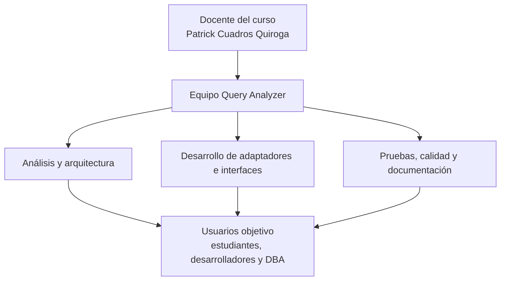

\pagebreak

# II. Visionamiento de la Empresa

## 1. Descripción del Problema

Los usuarios que analizan rendimiento de consultas enfrentan una alta fragmentación
técnica. PostgreSQL, MySQL, SQLite, SQL Server, CockroachDB, YugabyteDB, MongoDB, Redis,
DynamoDB, Cassandra, Elasticsearch, Neo4j e InfluxDB ofrecen mecanismos distintos para
obtener planes, métricas o trazas. Esta situación genera los siguientes problemas:

- aprendizaje repetido de comandos y formatos por motor;
- dificultad para conservar evidencia comparable dentro de un mismo reporte;
- riesgo de interpretar como equivalentes métricas que no tienen la misma semántica;
- exposición accidental de credenciales al usar scripts o herramientas aisladas;
- dependencia de procesos manuales para documentar antes y después de una optimización;
- confusión entre datos reales del motor y recomendaciones generadas por IA o heurísticas.

## 2. Objetivos de Negocios

| ID | Objetivo de negocio | Resultado esperado |
|---|---|---|
| ON-01 | Reducir el esfuerzo de diagnóstico de consultas | Usar un flujo común para múltiples motores |
| ON-02 | Incrementar la confiabilidad de la evidencia técnica | Conservar plan original, métricas disponibles y fecha de análisis |
| ON-03 | Facilitar el aprendizaje de rendimiento de bases de datos | Mostrar planes y métricas de forma comprensible |
| ON-04 | Mejorar la seguridad de credenciales | Cifrar perfiles y sanitizar mensajes sensibles |
| ON-05 | Favorecer la integración con herramientas modernas | Exponer CLI, TUI, API REST, MCP y extensión VS Code |

## 3. Objetivos de Diseño

| ID | Objetivo de diseño | Decisión asociada |
|---|---|---|
| OD-01 | Mantener bajo acoplamiento entre motores e interfaces | Uso de `AdapterRegistry` y `BaseAdapter` |
| OD-02 | Representar planes de forma común sin perder detalle | Uso de `PlanNode`, `raw_plan` y `metrics` |
| OD-03 | Evitar diagnósticos no verificables | No incluir score universal ni antipatrones deterministas centrales |
| OD-04 | Proteger secretos | Uso de perfiles cifrados, `SecretStr` y sanitización |
| OD-05 | Permitir operación local | API enlazada a `127.0.0.1` por defecto y MCP por stdio |
| OD-06 | Tolerar ausencia o fallo de IA | `AIAnalysisResult` opcional y separado del reporte factual |

## 4. Alcance del proyecto

### Incluido

- Administración de perfiles locales de conexión.
- Cifrado de credenciales persistidas.
- Diagnóstico de configuración, DNS, TCP, autenticación y operación.
- Registro de motores mediante `AdapterRegistry`.
- Ejecución de `EXPLAIN` o mecanismo equivalente.
- Construcción de `QueryAnalysisReport` factual.
- Normalización parcial del plan mediante `PlanNode`.
- Conservación del plan original del motor.
- Métricas específicas por adaptador.
- Historial local y exportación de reportes.
- Interfaces CLI, TUI y API REST local.
- Servidor MCP con herramienta de análisis.
- Extensión para Visual Studio Code.
- Interpretación opcional mediante proveedores compatibles con API tipo OpenAI.
- Pruebas unitarias, de contrato, integración y documentación.

### Fuera de alcance

- Modificar consultas, índices o esquemas automáticamente.
- Reemplazar una plataforma APM o monitoreo continuo.
- Garantizar que una sugerencia de IA mejore el rendimiento.
- Generar una puntuación universal de calidad.
- Comparar como equivalentes métricas incompatibles entre motores.
- Persistir credenciales recibidas por API REST.
- Ejecutar operaciones destructivas como parte del flujo normal.

## 5. Viabilidad del Sistema

El sistema es viable técnica, operativa y económicamente. La solución utiliza Python,
Pydantic, Typer, Rich, Textual, FastAPI, Docker, TypeScript y GitHub Actions, tecnologías
disponibles y adecuadas para el alcance académico. Los costos se concentran en el tiempo
del equipo, conectividad y energía; no requiere licencias comerciales para el desarrollo
ni para su ejecución principal.

El diseño por adaptadores permite extender motores sin reescribir las interfaces. La
separación entre datos factuales e IA reduce riesgos de interpretación y mejora la
transparencia del producto.

## 6. Información obtenida del Levantamiento de Información

| Fuente | Información obtenida | Uso en el sistema |
|---|---|---|
| Revisión de motores de bases de datos | Cada motor expone planes y métricas con sintaxis distinta | Definición de adaptadores por motor |
| Revisión de necesidades académicas | Se requiere evidencia reproducible para estudiar rendimiento | Reportes factuales exportables |
| Pruebas con servicios locales | Algunos motores requieren Docker o emuladores | Separación de pruebas unitarias e integración |
| Uso de CLI/TUI/API | Los usuarios necesitan distintos niveles de interacción | Interfaces múltiples sobre el mismo núcleo |
| Revisión de seguridad | Las credenciales deben protegerse y no aparecer en errores | Cifrado, `SecretStr` y sanitización |
| Uso de agentes y editores | MCP y VS Code reducen fricción de uso | Servidor MCP y extensión empaquetada |

\pagebreak

# III. Análisis de Procesos

## a) Diagrama del Proceso Actual - Diagrama de actividades

El proceso actual representa el trabajo manual antes de contar con Query Analyzer.

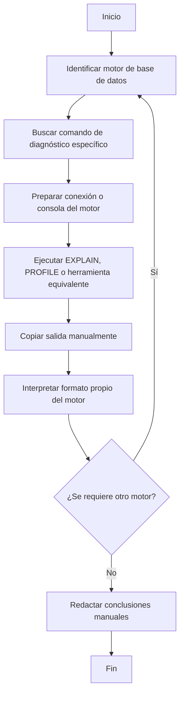

### Problemas del proceso actual

- No existe un formato común de reporte.
- La evidencia se copia manualmente y puede perder contexto.
- Los secretos pueden quedar expuestos en scripts o capturas.
- Las métricas se interpretan sin reglas claras por motor.
- La comparación entre motores puede inducir errores.

## b) Diagrama del Proceso Propuesto - Diagrama de actividades inicial

El proceso propuesto centraliza el análisis mediante Query Analyzer.

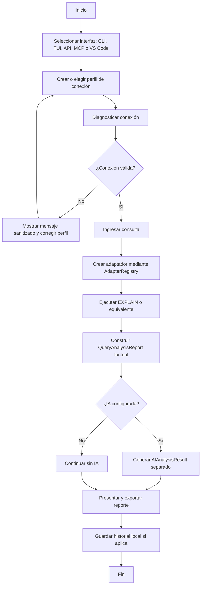

\pagebreak

# IV. Especificación de Requerimientos de Software

## a) Cuadro de Requerimientos funcionales inicial

| ID | Requerimiento funcional inicial | Prioridad |
|---|---|:---:|
| RFI-01 | Registrar motores de bases de datos mediante un catálogo común | Alta |
| RFI-02 | Crear perfiles de conexión por motor | Alta |
| RFI-03 | Ejecutar análisis de consulta desde línea de comandos | Alta |
| RFI-04 | Obtener plan de ejecución o mecanismo equivalente del motor | Alta |
| RFI-05 | Mostrar resumen del plan y métricas disponibles | Alta |
| RFI-06 | Exportar resultados para documentación | Media |
| RFI-07 | Proteger credenciales almacenadas | Alta |
| RFI-08 | Permitir pruebas con motores locales mediante Docker | Media |

## b) Cuadro de Requerimientos no funcionales

| ID | Requerimiento no funcional | Criterio de aceptación |
|---|---|---|
| RNF-01 | Ejecutarse con Python 3.14+ | El proyecto corre mediante `uv run` y binarios distribuidos |
| RNF-02 | Mantener formato y lint automatizado | Ruff debe aprobar revisión y formato |
| RNF-03 | Mantener tipado verificable | mypy debe validar el paquete principal |
| RNF-04 | No exponer secretos | Errores y respuestas públicas deben estar sanitizados |
| RNF-05 | Liberar conexiones correctamente | Los adaptadores deben soportar context manager |
| RNF-06 | Separar datos factuales de IA | `AIAnalysisResult` no modifica métricas del reporte |
| RNF-07 | Operar localmente por defecto | API en `127.0.0.1` y MCP por stdio |
| RNF-08 | Soportar extensibilidad por motor | Nuevos motores deben integrarse mediante adaptadores |
| RNF-09 | Conservar compatibilidad de reportes | `QueryAnalysisReport` debe preservar plan original y normalizado |
| RNF-10 | Diferenciar ausencia de datos de valor cero | Valores no disponibles deben quedar como `None` u omitidos |
| RNF-11 | No calcular score universal | El reporte no debe contener puntuación global de calidad |
| RNF-12 | Proporcionar documentación navegable | GitHub Pages debe renderizar informes y evidencias |

## c) Cuadro de Requerimientos funcionales final

| ID | Requerimiento funcional final | Actor principal | Estado |
|---|---|---|---|
| RFF-01 | Registrar y listar motores con `AdapterRegistry` | Sistema | Implementado |
| RFF-02 | Validar `ConnectionConfig` por motor | Sistema | Implementado |
| RFF-03 | Crear, listar, consultar, seleccionar y eliminar perfiles | Usuario CLI/TUI | Implementado |
| RFF-04 | Cifrar credenciales de perfiles locales | Sistema | Implementado |
| RFF-05 | Diagnosticar configuración, DNS, TCP, autenticación y operación | Usuario CLI/TUI/API | Implementado |
| RFF-06 | Ejecutar `EXPLAIN` o mecanismo equivalente por adaptador | Usuario | Implementado |
| RFF-07 | Construir `PlanNode` cuando exista plan jerárquico | Sistema | Implementado |
| RFF-08 | Construir `QueryAnalysisReport` factual | Sistema | Implementado |
| RFF-09 | Conservar `raw_plan` y métricas específicas | Sistema | Implementado |
| RFF-10 | Mostrar resultados en CLI con Rich | Usuario CLI | Implementado |
| RFF-11 | Mostrar resultados en TUI con Textual | Usuario TUI | Implementado |
| RFF-12 | Mantener historial local por perfil | Usuario TUI | Implementado |
| RFF-13 | Exportar reportes en JSON y Markdown | Usuario | Implementado |
| RFF-14 | Exponer API REST bajo `/api/v1/analyzer` | Cliente HTTP | Implementado |
| RFF-15 | Exponer herramienta MCP `analyze_query(query, profile)` | Agente compatible | Implementado |
| RFF-16 | Analizar consultas desde Visual Studio Code | Usuario VS Code | Implementado |
| RFF-17 | Ejecutar interpretación IA opcional | Usuario con proveedor IA | Implementado |
| RFF-18 | Soportar 13 motores registrados | Sistema | Implementado |
| RFF-19 | Publicar documentación y evidencias en GitHub Pages | Equipo | Implementado |
| RFF-20 | Generar artefactos de release por plataforma | Equipo | Implementado |

### Motores soportados

| Categoría | Motores |
|---|---|
| SQL y NewSQL | PostgreSQL, MySQL, SQLite, Microsoft SQL Server, CockroachDB y YugabyteDB |
| NoSQL | MongoDB, Redis, DynamoDB, Cassandra y Elasticsearch |
| Grafos | Neo4j |
| Series de tiempo | InfluxDB |

## d) Reglas de Negocio

| ID | Regla de negocio |
|---|---|
| RN-01 | Todo motor soportado debe registrarse en `AdapterRegistry`. |
| RN-02 | Todo adaptador debe implementar conexión, desconexión, prueba de conexión y análisis. |
| RN-03 | El motor se normaliza a minúsculas antes de validarse. |
| RN-04 | Solo se aceptan motores incluidos en el catálogo soportado. |
| RN-05 | Todo puerto configurado debe estar entre 1 y 65535. |
| RN-06 | SQLite y DynamoDB no requieren puerto TCP para su configuración mínima. |
| RN-07 | Redis, Cassandra, DynamoDB y Elasticsearch pueden operar sin nombre de base de datos tradicional. |
| RN-08 | SQLite permite contraseña vacía por ser un motor basado en archivo local. |
| RN-09 | CockroachDB puede aceptar contraseña vacía en escenarios locales de desarrollo. |
| RN-10 | Si una contraseña se proporciona para motores que la requieren, no puede quedar vacía. |
| RN-11 | Las credenciales persistidas en perfiles deben cifrarse. |
| RN-12 | La API REST no debe persistir credenciales recibidas en solicitudes. |
| RN-13 | Los mensajes públicos no deben exponer contraseñas, tokens, API keys ni cabeceras Bearer. |
| RN-14 | `QueryAnalysisReport.execution_time_ms` debe ser mayor que cero. |
| RN-15 | El reporte debe incluir motor, consulta, tiempo de ejecución, resumen, fecha y métricas disponibles. |
| RN-16 | El plan original debe conservarse cuando el motor lo entregue. |
| RN-17 | `PlanNode` debe usarse solo cuando exista una estructura jerárquica representable. |
| RN-18 | La ausencia de una métrica no debe reemplazarse por cero. |
| RN-19 | El sistema no debe calcular una puntuación universal de calidad. |
| RN-20 | Las recomendaciones de IA deben almacenarse en `AIAnalysisResult` y no mezclarse con métricas factuales. |
| RN-21 | Si la IA no está configurada o falla, el análisis factual debe seguir siendo válido. |
| RN-22 | Las interfaces CLI, TUI, API, MCP y VS Code deben reutilizar el mismo núcleo de análisis. |
| RN-23 | Las operaciones normales de análisis no deben modificar esquemas, índices ni datos del motor. |
| RN-24 | Las pruebas unitarias no deben depender de Docker. |
| RN-25 | Las pruebas de integración que requieren motores reales deben mantenerse separadas. |

\pagebreak

# V. Fase de Desarrollo

## 1. Perfiles de Usuario

| Perfil | Descripción | Necesidades principales |
|---|---|---|
| Estudiante de bases de datos | Usuario académico que estudia planes de ejecución | Ejecutar análisis simples, observar planes y exportar evidencia |
| Desarrollador | Usuario que optimiza consultas durante desarrollo | Diagnosticar perfiles, comparar resultados y usar CLI/VS Code |
| Administrador de bases de datos | Usuario técnico con conocimiento de motores | Revisar métricas específicas y planes originales |
| Docente / evaluador | Revisa el cumplimiento del proyecto | Consultar documentación, evidencias y criterios de calidad |
| Cliente HTTP | Sistema externo que invoca la API | Enviar conexión y consulta para recibir reporte estructurado |
| Agente compatible con MCP | Asistente que usa herramientas estructuradas | Invocar `analyze_query` con un perfil local |

## 2. Modelo Conceptual

El modelo conceptual se organiza alrededor de perfiles, adaptadores, reportes y
presentación. El usuario no interactúa directamente con drivers específicos; selecciona
un perfil o conexión y el sistema delega la ejecución al adaptador correspondiente.

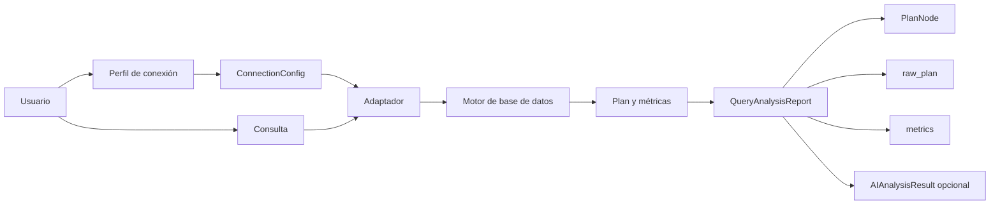

## a) Diagrama de Paquetes

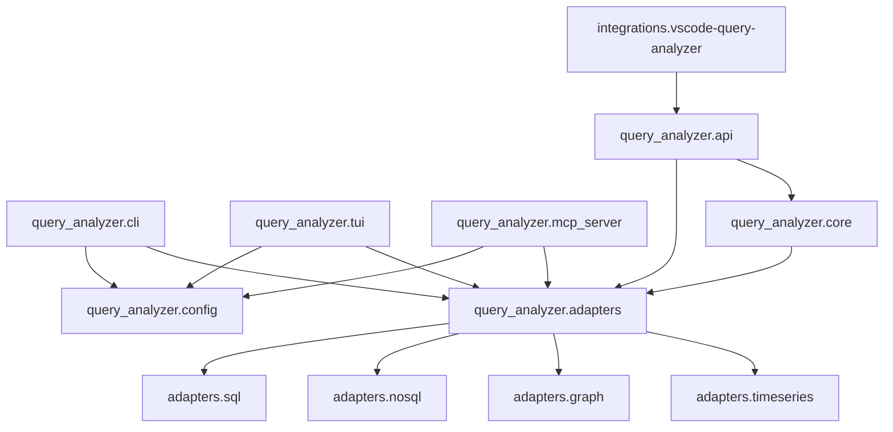

## b) Diagrama de Casos de Uso

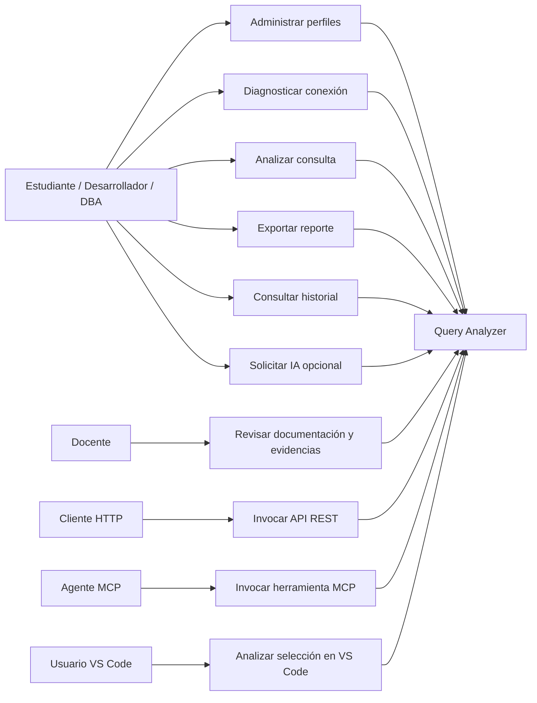

## c) Escenarios de Caso de Uso (narrativa)

### CU-01. Administrar perfil de conexión

| Campo | Descripción |
|---|---|
| Actor principal | Usuario CLI/TUI |
| Propósito | Crear, listar, consultar, seleccionar o eliminar perfiles de conexión |
| Precondición | El usuario conoce los datos mínimos del motor |
| Flujo principal | El usuario ingresa motor y credenciales; el sistema valida `ConnectionConfig`; cifra secretos; guarda el perfil local |
| Alternativas | Si el motor no es soportado o el puerto es inválido, se rechaza la configuración |
| Resultado | Perfil disponible para análisis y diagnóstico |

### CU-02. Diagnosticar conexión

| Campo | Descripción |
|---|---|
| Actor principal | Usuario CLI/TUI/API |
| Propósito | Verificar si un perfil o conexión puede operar antes de analizar |
| Precondición | Existe una configuración de conexión |
| Flujo principal | El sistema valida configuración, verifica conectividad, prueba autenticación y ejecuta comprobación operativa |
| Alternativas | Si falla una etapa, se devuelve mensaje claro y sanitizado |
| Resultado | Diagnóstico con estado, duración y detalle seguro |

### CU-03. Analizar consulta

| Campo | Descripción |
|---|---|
| Actor principal | Usuario |
| Propósito | Obtener plan, métricas y resumen factual de una consulta |
| Precondición | Existe conexión válida y consulta no vacía |
| Flujo principal | El sistema crea adaptador; conecta; ejecuta `EXPLAIN` o equivalente; construye `QueryAnalysisReport`; desconecta |
| Alternativas | Si el motor no entrega plan jerárquico, el reporte conserva métricas o datos disponibles |
| Resultado | Reporte factual listo para visualizar o exportar |

### CU-04. Exportar reporte

| Campo | Descripción |
|---|---|
| Actor principal | Usuario CLI/TUI |
| Propósito | Guardar evidencia de análisis en formato reutilizable |
| Precondición | Existe un `QueryAnalysisReport` válido |
| Flujo principal | El usuario elige formato; el sistema serializa a JSON o Markdown |
| Alternativas | Si el destino no es escribible, se informa error sin perder el reporte en memoria |
| Resultado | Archivo de reporte disponible para documentación o comparación |

### CU-05. Solicitar interpretación IA opcional

| Campo | Descripción |
|---|---|
| Actor principal | Usuario con proveedor IA configurado |
| Propósito | Obtener explicación natural de la evidencia |
| Precondición | Existen variables o parámetros de proveedor IA |
| Flujo principal | El sistema envía plan, consulta y motor al proveedor; recibe resumen, observaciones y recomendaciones |
| Alternativas | Si IA falla, el sistema mantiene el reporte factual sin bloquear el análisis |
| Resultado | `AIAnalysisResult` adjunto y separado del reporte factual |

### CU-06. Usar API REST

| Campo | Descripción |
|---|---|
| Actor principal | Cliente HTTP |
| Propósito | Integrar análisis de consultas desde otra aplicación |
| Precondición | API local activa |
| Flujo principal | El cliente envía conexión y consulta a `/api/v1/analyzer/explain`; el sistema responde con reporte estructurado |
| Alternativas | Si la solicitud es inválida, se devuelve error controlado |
| Resultado | Respuesta JSON con evidencia factual |

### CU-07. Usar herramienta MCP

| Campo | Descripción |
|---|---|
| Actor principal | Agente compatible con MCP |
| Propósito | Permitir análisis desde asistentes de programación |
| Precondición | Servidor MCP iniciado por stdio y perfil disponible |
| Flujo principal | El agente llama `analyze_query(query, profile)`; el servidor usa el perfil local y devuelve reporte |
| Alternativas | Si no se indica perfil, se usa el perfil por defecto configurado |
| Resultado | Análisis estructurado consumible por el agente |

### CU-08. Analizar desde Visual Studio Code

| Campo | Descripción |
|---|---|
| Actor principal | Usuario VS Code |
| Propósito | Analizar la consulta seleccionada desde el editor |
| Precondición | Extensión instalada y backend local disponible |
| Flujo principal | El usuario selecciona SQL; ejecuta comando; la extensión invoca backend/API local; muestra resultado |
| Alternativas | Si el backend no está disponible, la extensión intenta iniciarlo o informa el problema |
| Resultado | Reporte visible desde el flujo de trabajo del editor |

\pagebreak

## 3. Modelo Lógico

## a) Análisis de Objetos

| Objeto | Responsabilidad | Atributos relevantes |
|---|---|---|
| `ConnectionConfig` | Representar configuración de conexión validada | `engine`, `host`, `port`, `database`, `username`, `password`, `extra` |
| `ProfileConfig` | Persistir datos de perfil local | nombre, motor, conexión, valores por defecto |
| `ConfigManager` | Administrar perfiles y cifrado | perfiles, perfil activo, rutas de configuración |
| `AdapterRegistry` | Registrar y crear adaptadores | catálogo de motores y clases |
| `BaseAdapter` | Definir contrato común de motores | `connect`, `disconnect`, `execute_explain`, `get_metrics` |
| Adaptador concreto | Ejecutar lógica específica del motor | driver, parser, métricas y plan original |
| `PlanNode` | Representar nodo del plan normalizado | `node_type`, `cost`, `estimated_rows`, `actual_rows`, `actual_time_ms`, `children`, `properties` |
| `AIAnalysisResult` | Contener interpretación opcional de IA | `summary`, `observations`, `recommendations`, `suggested_query`, `raw_response` |
| `QueryAnalysisReport` | Agrupar evidencia factual del análisis | `engine`, `query`, `execution_time_ms`, `plan_tree`, `plan_summary`, `raw_plan`, `metrics`, `analyzed_at`, `ai_analysis` |
| `ReportSerializer` | Exportar e importar reportes | JSON, Markdown y diccionarios |
| `ConnectionDiagnostics` | Ejecutar diagnóstico progresivo | estado, duración, mensaje seguro |
| `HistoryManager` | Guardar historial local de análisis | reportes por perfil y límites de retención |
| API Router | Exponer endpoints REST | rutas bajo `/api/v1/analyzer` |
| MCP Server | Exponer herramienta para agentes | `analyze_query(query, profile)` |

## b) Diagrama de Actividades con objetos

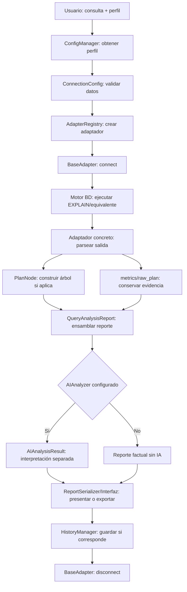

## c) Diagrama de Secuencia

### CU-01. Administrar perfil de conexión

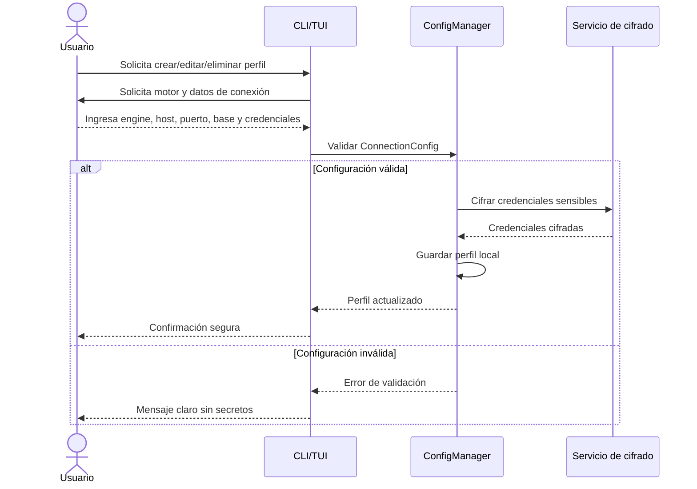

### CU-02. Diagnosticar conexión

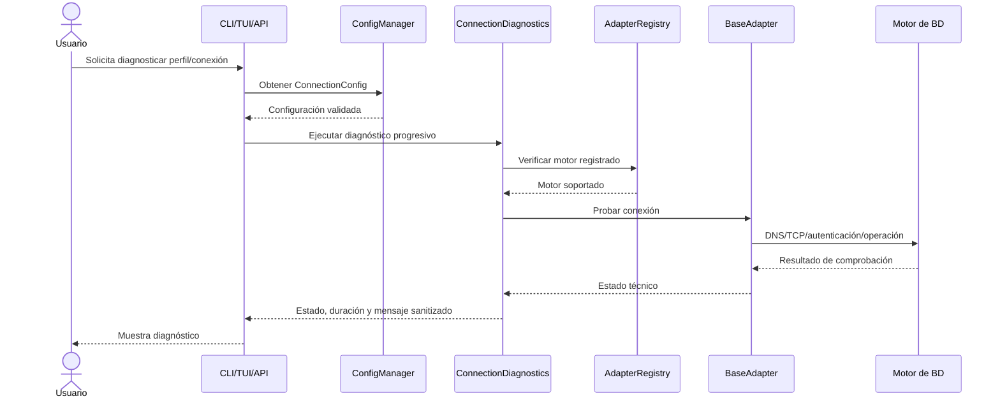

### CU-03. Analizar consulta

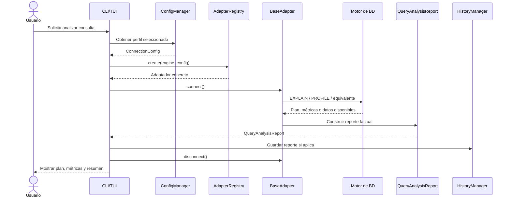

### CU-04. Exportar reporte

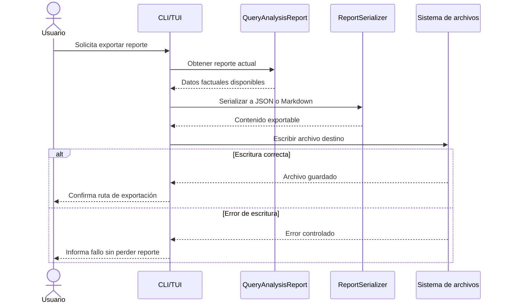

### CU-05. Solicitar interpretación IA opcional

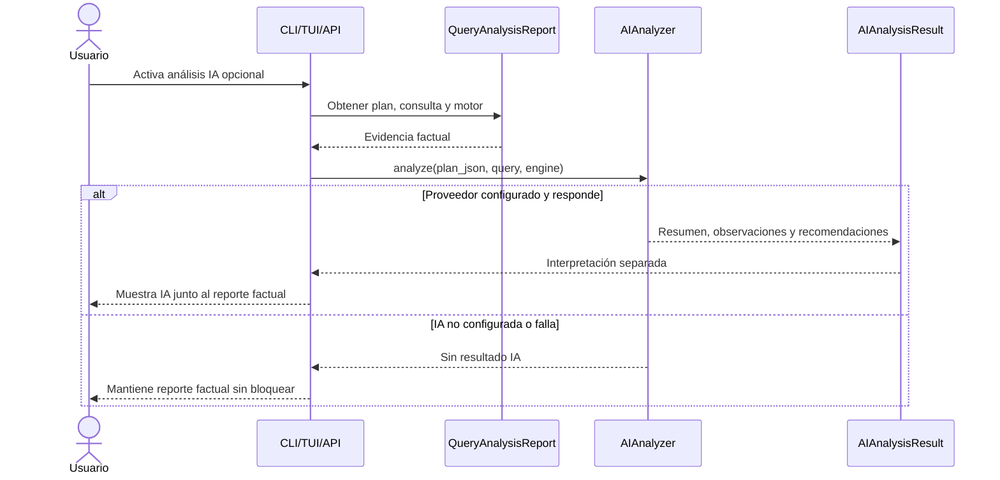

### CU-06. Usar API REST

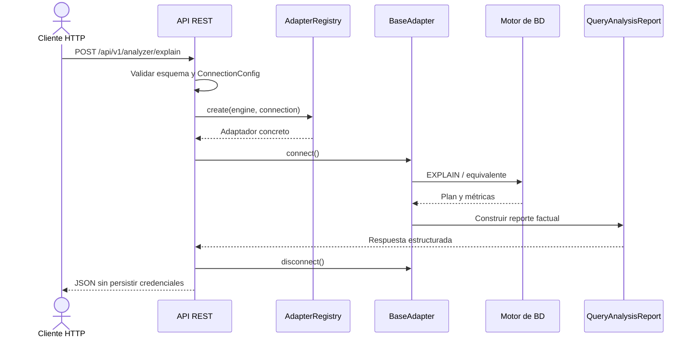

### CU-07. Usar herramienta MCP

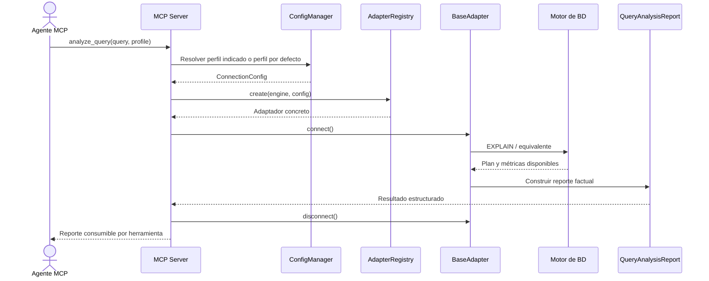

### CU-08. Analizar desde Visual Studio Code

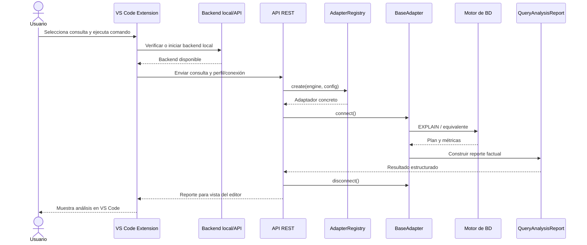

## d) Diagrama de Clases

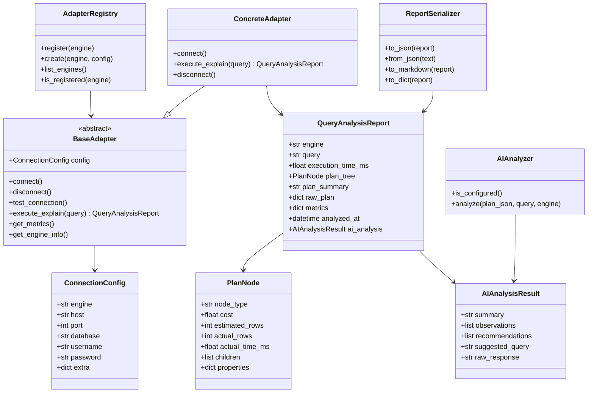

\pagebreak

# CONCLUSIONES

1. Query Analyzer resuelve una necesidad real de análisis de consultas en entornos con
   múltiples motores, reduciendo la fragmentación de comandos y formatos.
2. La especificación final conserva el enfoque factual del proyecto: reportar datos del
   motor, mantener el plan original y evitar puntuaciones universales.
3. La arquitectura por adaptadores permite soportar 13 motores sin acoplar las interfaces
   de usuario a drivers específicos.
4. Los perfiles locales, cifrado y sanitización de mensajes atienden los principales
   riesgos de seguridad de credenciales.
5. Las interfaces CLI, TUI, API REST, MCP y VS Code amplían la utilidad del sistema para
   estudiantes, desarrolladores, administradores y agentes de programación.
6. La IA opcional aporta interpretación, pero no altera el reporte factual ni bloquea el
   análisis cuando no está configurada.

# RECOMENDACIONES

1. Mantener sincronizados FD01, FD02, FD03, FD04 y FD05 cuando se agreguen nuevos motores
   o cambien contratos de análisis.
2. Documentar por motor el significado exacto de métricas específicas para evitar
   comparaciones incorrectas.
3. Ampliar escenarios de uso con ejemplos reales antes/después de optimizaciones.
4. Mantener la API REST enlazada a localhost por defecto mientras no exista autenticación
   formal para exposición en red.
5. Continuar reforzando pruebas de sanitización de secretos y errores públicos.
6. Agregar migraciones explícitas si el esquema de historial local cambia en versiones
   futuras.

# BIBLIOGRAFÍA

1. Bass, L., Clements, P., & Kazman, R. (2021). *Software Architecture in Practice*.
2. Fowler, M. (2002). *Patterns of Enterprise Application Architecture*.
3. Gamma, E., Helm, R., Johnson, R., & Vlissides, J. (1994). *Design Patterns*.
4. Kleppmann, M. (2017). *Designing Data-Intensive Applications*.
5. Pressman, R. S., & Maxim, B. R. (2020). *Software Engineering: A Practitioner's Approach*.
6. Sommerville, I. (2016). *Software Engineering*.
7. ISO/IEC 25010:2011. *Systems and software quality models*.
8. Ley N.° 29733. Ley de Protección de Datos Personales del Perú.

# WEBGRAFÍA

- Python: <https://docs.python.org/3/>
- uv: <https://docs.astral.sh/uv/>
- Pydantic: <https://docs.pydantic.dev/>
- Typer: <https://typer.tiangolo.com/>
- Rich: <https://rich.readthedocs.io/>
- Textual: <https://textual.textualize.io/>
- FastAPI: <https://fastapi.tiangolo.com/>
- PostgreSQL EXPLAIN: <https://www.postgresql.org/docs/current/using-explain.html>
- MySQL EXPLAIN: <https://dev.mysql.com/doc/refman/8.0/en/explain.html>
- MongoDB Explain Results: <https://www.mongodb.com/docs/manual/reference/explain-results/>
- Neo4j Execution Plans: <https://neo4j.com/docs/cypher-manual/current/planning-and-tuning/execution-plans/>
- GitHub Actions: <https://docs.github.com/actions>
- Visual Studio Code Extension API: <https://code.visualstudio.com/api>
- Model Context Protocol: <https://modelcontextprotocol.io/>
