

**UNIVERSIDAD PRIVADA DE TACNA**

**FACULTAD DE INGENIERÍA**

**Escuela Profesional de Ingeniería de Sistemas**

**Informe de Arquitectura de Software**

**Sistema Analizador de Rendimiento de Consultas (Query Analyzer)**

Curso: *Base de Datos II*

Docente: *Patrick Cuadros Quiroga*

Integrantes:

***Carbajal Vargas, Andre Alejandro (2023077287)***

***Yupa Gómez, Fátima Sofía (2023076618)***

**Tacna - Perú**

***2026***

\pagebreak

Sistema *Analizador de Rendimiento de Consultas (Query Analyzer)*

Informe de Arquitectura de Software

Versión *1.2*

| CONTROL DE VERSIONES | | | | | |
|:---:|:---|:---|:---|:---:|:---|
| Versión | Hecha por | Revisada por | Aprobada por | Fecha | Motivo |
| 1.0 | ACV, FYG | ACV, FYG | P. Cuadros Q. | 2026-04-29 | Versión inicial |
| 1.1 | ACV, FYG | ACV, FYG | P. Cuadros Q. | 2026-06-23 | Actualización factual y formato institucional |
| 1.2 | ACV, FYG | ACV, FYG | P. Cuadros Q. | 2026-07-04 | Ampliación con vistas 4+1, despliegue y atributos de calidad |

\pagebreak

# ÍNDICE GENERAL

1. [INTRODUCCIÓN](#1-introducción)
   1. [Propósito (Diagrama 4+1)](#11-propósito-diagrama-41)
   2. [Alcance](#12-alcance)
   3. [Definición, siglas y abreviaturas](#13-definición-siglas-y-abreviaturas)
   4. [Organización del documento](#14-organización-del-documento)
2. [OBJETIVOS Y RESTRICCIONES ARQUITECTÓNICAS](#2-objetivos-y-restricciones-arquitectónicas)
   1. [Requerimientos Funcionales](#211-requerimientos-funcionales)
   2. [Requerimientos No Funcionales - Atributos de Calidad](#212-requerimientos-no-funcionales---atributos-de-calidad)
3. [REPRESENTACIÓN DE LA ARQUITECTURA DEL SISTEMA](#3-representación-de-la-arquitectura-del-sistema)
   1. [Vista de Caso de uso](#31-vista-de-caso-de-uso)
   2. [Vista Lógica](#32-vista-lógica)
   3. [Vista de Implementación (vista de desarrollo)](#33-vista-de-implementación-vista-de-desarrollo)
   4. [Vista de procesos](#34-vista-de-procesos)
   5. [Vista de Despliegue (vista física)](#35-vista-de-despliegue-vista-física)
4. [ATRIBUTOS DE CALIDAD DEL SOFTWARE](#4-atributos-de-calidad-del-software)
   1. [Escenario de Funcionalidad](#escenario-de-funcionalidad)
   2. [Escenario de Usabilidad](#escenario-de-usabilidad)
   3. [Escenario de confiabilidad](#escenario-de-confiabilidad)
   4. [Escenario de rendimiento](#escenario-de-rendimiento)
   5. [Escenario de mantenibilidad](#escenario-de-mantenibilidad)
   6. [Otros Escenarios](#otros-escenarios)

\pagebreak

# 1. INTRODUCCIÓN

Query Analyzer es una herramienta local y extensible para analizar planes de ejecución,
métricas observables y evidencia técnica de consultas en múltiples motores de bases de
datos. La solución ofrece varias entradas de uso: CLI, TUI, API REST local, servidor MCP
y extensión para Visual Studio Code. Todas reutilizan un núcleo común basado en modelos
Pydantic, registro de adaptadores y reportes factuales.

Este documento describe la arquitectura de software del sistema usando el modelo de
vistas 4+1. La arquitectura combina capas, patrón Adapter, contratos de datos y
separación explícita entre evidencia factual e interpretación opcional mediante IA.

## 1.1. Propósito (Diagrama 4+1)

El propósito del documento es comunicar cómo se organiza Query Analyzer para cumplir sus
requisitos funcionales, atributos de calidad y restricciones de operación local. El
modelo 4+1 permite describir la arquitectura desde cinco perspectivas complementarias:
casos de uso, lógica, implementación, procesos y despliegue.

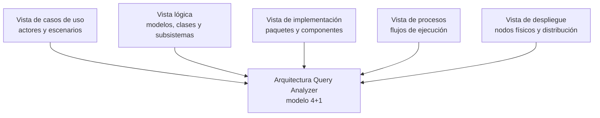

## 1.2. Alcance

El informe cubre la arquitectura de la versión documentada de Query Analyzer, incluyendo:

- administración segura de perfiles;
- diagnóstico de conexiones;
- ejecución de `EXPLAIN` o mecanismo equivalente;
- normalización parcial mediante `PlanNode`;
- construcción de `QueryAnalysisReport`;
- conservación de `raw_plan` y métricas específicas;
- exportación JSON/Markdown;
- CLI, TUI, API REST local, MCP y extensión VS Code;
- análisis opcional con IA mediante `AIAnalysisResult`;
- documentación, pruebas y distribución multiplataforma.

Quedan fuera del alcance arquitectónico las modificaciones automáticas de consultas,
índices o esquemas, el monitoreo continuo de producción y cualquier score universal de
calidad entre motores.

## 1.3. Definición, siglas y abreviaturas

| Término | Definición |
|---|---|
| API | Interfaz HTTP local implementada con FastAPI |
| CLI | Interfaz de línea de comandos |
| TUI | Interfaz terminal interactiva implementada con Textual |
| MCP | Model Context Protocol para integración con agentes |
| VS Code | Visual Studio Code, editor integrado mediante extensión |
| Adapter | Componente que encapsula diferencias de un motor de base de datos |
| `AdapterRegistry` | Fábrica y catálogo de adaptadores registrados |
| `ConnectionConfig` | Modelo de configuración validada para conectarse a un motor |
| `PlanNode` | Nodo recursivo y agnóstico para representar planes normalizados |
| `QueryAnalysisReport` | Reporte factual con consulta, motor, métricas, plan y fecha |
| `AIAnalysisResult` | Interpretación opcional generada por IA, separada del reporte factual |
| `raw_plan` | Plan original entregado por el motor |

## 1.4. Organización del documento

El documento se organiza en cuatro secciones principales. La primera define propósito,
alcance y terminología. La segunda resume objetivos y restricciones arquitectónicas. La
tercera presenta las vistas 4+1 del sistema mediante diagramas. La cuarta describe
escenarios de calidad relacionados con funcionalidad, usabilidad, confiabilidad,
rendimiento, mantenibilidad y seguridad.

\pagebreak

# 2. OBJETIVOS Y RESTRICCIONES ARQUITECTÓNICAS

La arquitectura de Query Analyzer responde a una decisión central: el sistema debe
presentar evidencia real de motores heterogéneos sin inventar métricas ni mezclar
interpretación con datos factuales. Por ello, el diseño favorece contratos explícitos,
adaptadores desacoplados, validación de entradas, sanitización de secretos y reutilización
del núcleo por todas las interfaces.

## 2.1.1. Requerimientos Funcionales

| ID | Requerimiento funcional arquitectónico | Soporte arquitectónico |
|---|---|---|
| RF-01 | Registrar y crear adaptadores por motor | `AdapterRegistry` y `BaseAdapter` |
| RF-02 | Validar conexiones por motor | `ConnectionConfig` y validadores Pydantic |
| RF-03 | Administrar perfiles locales | `query_analyzer.config` y almacenamiento YAML cifrado |
| RF-04 | Diagnosticar conexiones | `ConnectionDiagnostics` y adaptadores |
| RF-05 | Ejecutar `EXPLAIN` o equivalente | Adaptadores SQL, NoSQL, grafos y series de tiempo |
| RF-06 | Construir reportes factuales | `QueryAnalysisReport` |
| RF-07 | Normalizar planes jerárquicos | `PlanNode` y parsers por motor |
| RF-08 | Conservar plan original y métricas | Campos `raw_plan` y `metrics` |
| RF-09 | Mostrar resultados en CLI y TUI | Paquetes `cli` y `tui` |
| RF-10 | Exponer API REST | Paquete `api` bajo `/api/v1/analyzer` |
| RF-11 | Exponer herramienta MCP | `query_analyzer.mcp_server` |
| RF-12 | Analizar desde VS Code | Extensión `integrations/vscode-query-analyzer` |
| RF-13 | Exportar reportes | `ReportSerializer` |
| RF-14 | Solicitar IA opcional | `AIAnalyzer` y `AIAnalysisResult` |

## 2.1.2. Requerimientos No Funcionales - Atributos de Calidad

| Atributo | Requerimiento | Decisión arquitectónica |
|---|---|---|
| Funcionalidad | Soportar 13 motores registrados | Catálogo explícito de adaptadores |
| Seguridad | No exponer secretos | Cifrado, `SecretStr`, sanitización y API sin persistencia de credenciales |
| Confiabilidad | Un fallo de IA no invalida el reporte factual | IA opcional y separada |
| Rendimiento | Evitar trabajo innecesario en la capa común | Delegación por adaptador y ejecución local |
| Usabilidad | Ofrecer varios canales de uso | CLI, TUI, API, MCP y VS Code |
| Mantenibilidad | Agregar motores sin reescribir interfaces | Patrón Adapter y contratos comunes |
| Portabilidad | Ejecutar en entornos locales y distribuidos por binario | Python, PyInstaller, JReleaser, VSIX |
| Observabilidad académica | Publicar documentación y evidencias | GitHub Pages y reportes de calidad |

### Restricciones arquitectónicas

- Usar `uv` como flujo de ejecución y dependencias.
- Mantener el servidor API en `127.0.0.1` por defecto.
- No persistir credenciales enviadas por API.
- No calcular score universal de calidad.
- No reemplazar métricas ausentes por cero.
- Separar pruebas unitarias de pruebas de integración con Docker.
- Mantener `QueryAnalysisReport` como contrato común entre interfaces.

\pagebreak

# 3. REPRESENTACIÓN DE LA ARQUITECTURA DEL SISTEMA

## 3.1. Vista de Caso de uso

La vista de caso de uso identifica los actores que interactúan con Query Analyzer y los
servicios principales que la arquitectura debe soportar.

### 3.1.1. Diagramas de Casos de uso

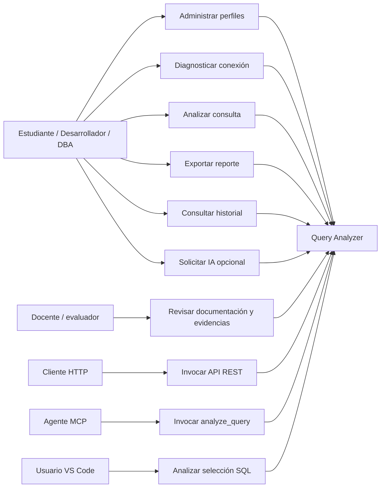

## 3.2. Vista Lógica

La vista lógica muestra los subsistemas de dominio y sus relaciones. El núcleo de la
solución es independiente de las interfaces y se apoya en modelos comunes.

### 3.2.1. Diagrama de Subsistemas (paquetes)

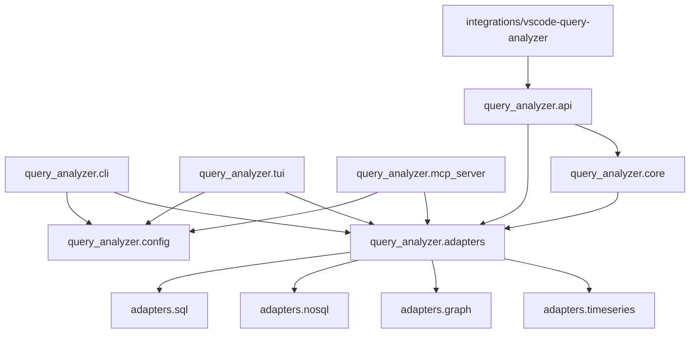

### 3.2.2. Diagrama de Secuencia (vista de diseño)

La vista de diseño presenta un diagrama de secuencia por cada caso de uso principal. De
esta forma se evita ocultar diferencias entre la administración de perfiles, el análisis
factual, la exportación, la IA opcional y las integraciones externas.

#### CU-01. Administrar perfil de conexión

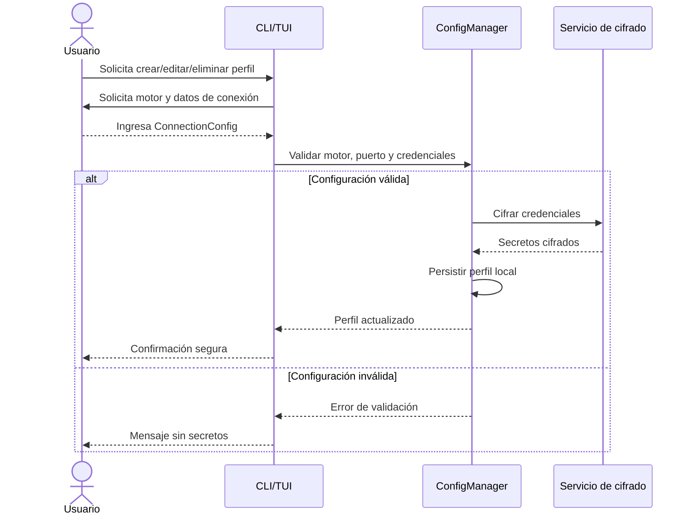

#### CU-02. Diagnosticar conexión

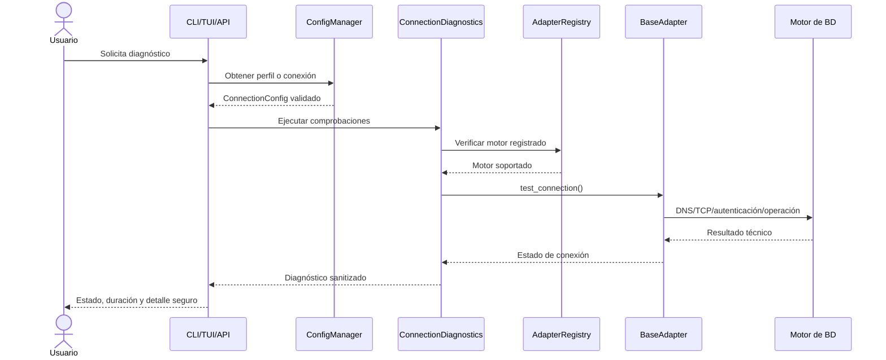

#### CU-03. Analizar consulta

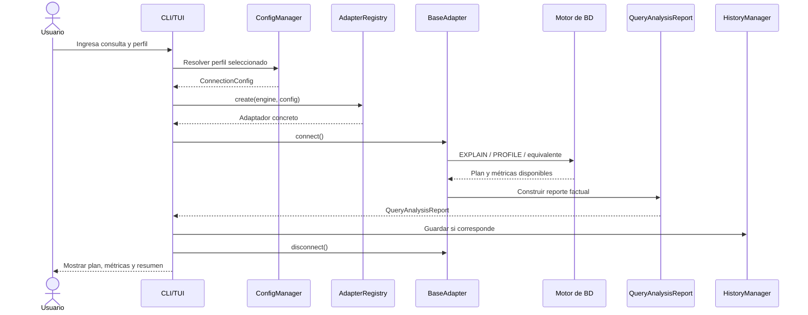

#### CU-04. Exportar reporte

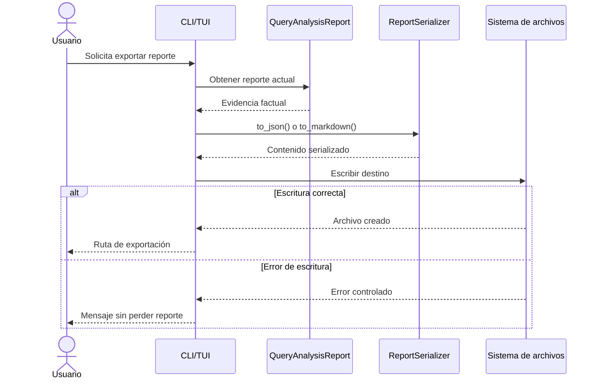

#### CU-05. Solicitar interpretación IA opcional

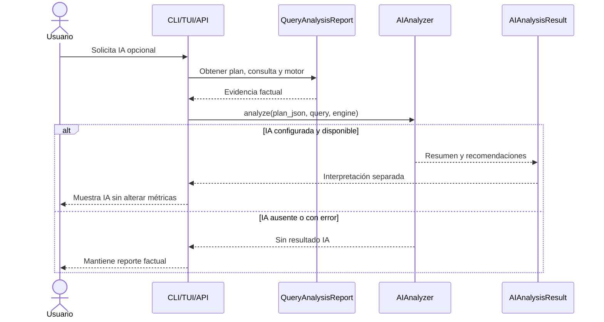

#### CU-06. Usar API REST

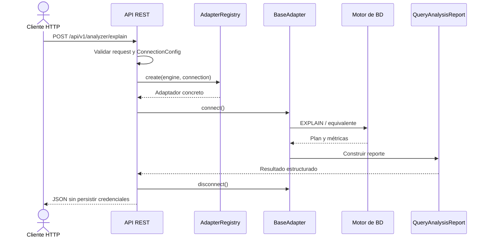

#### CU-07. Usar herramienta MCP

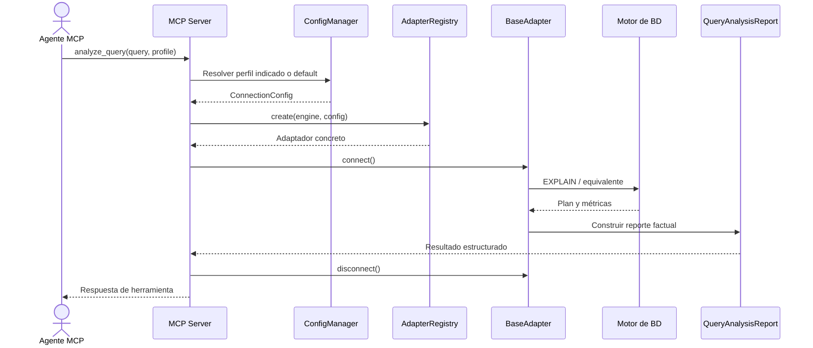

#### CU-08. Analizar desde Visual Studio Code

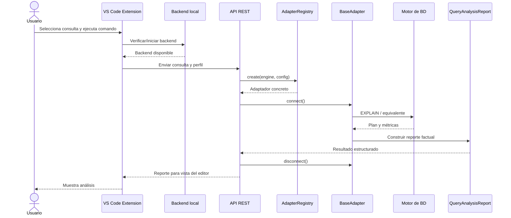

### 3.2.3. Diagrama de Colaboración (vista de diseño)

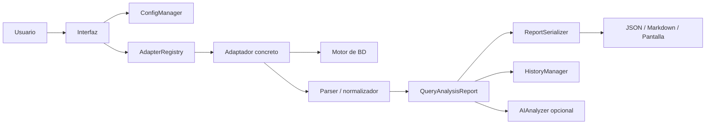

### 3.2.4. Diagrama de Objetos

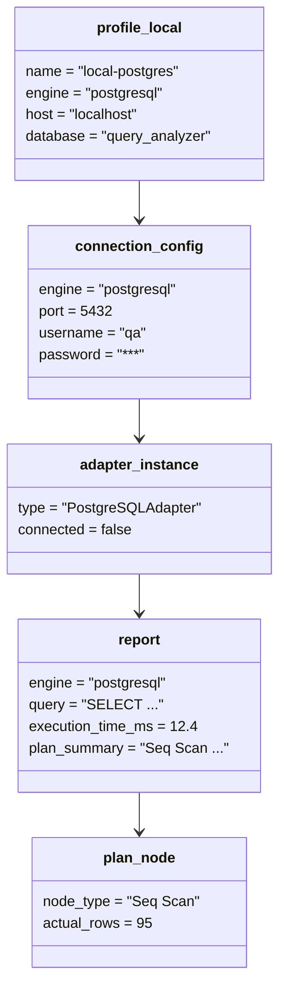

### 3.2.5. Diagrama de Clases

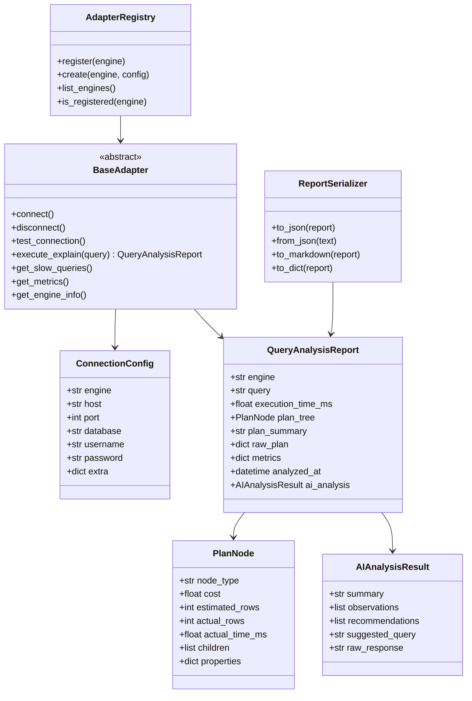

### 3.2.6. Diagrama de Base de datos (relacional o no relacional)

Query Analyzer no usa una base de datos central obligatoria. Persiste configuración e
historial de forma local mediante archivos YAML/JSON, y se conecta a motores externos
para obtener evidencia de análisis. Por ello, el diagrama representa persistencia local
no relacional y motores externos.

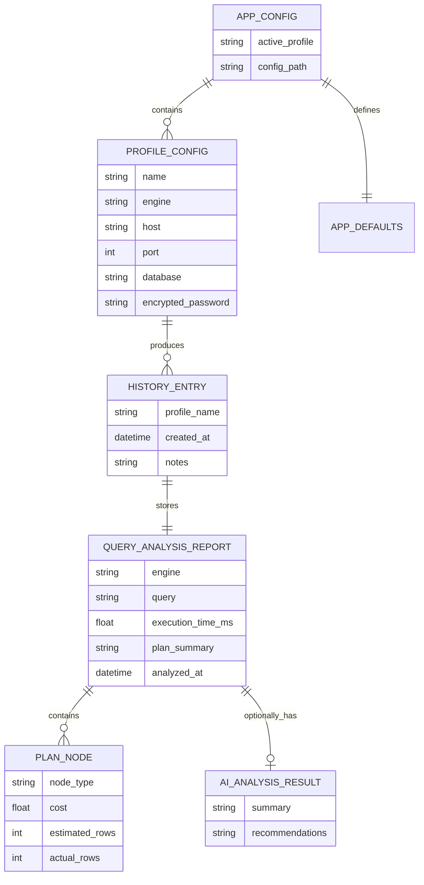

## 3.3. Vista de Implementación (vista de desarrollo)

La vista de implementación describe la organización del código y los componentes
desplegables. El repositorio mantiene paquetes separados por responsabilidad y
adaptadores agrupados por familia de motor.

### 3.3.1. Diagrama de arquitectura software (paquetes)

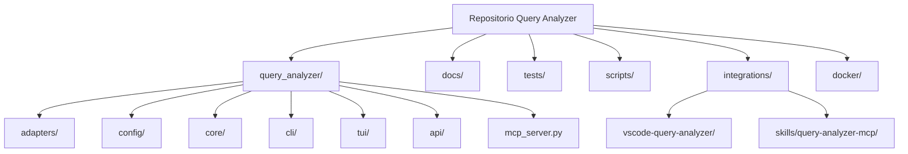

### 3.3.2. Diagrama de arquitectura del sistema (Diagrama de componentes)

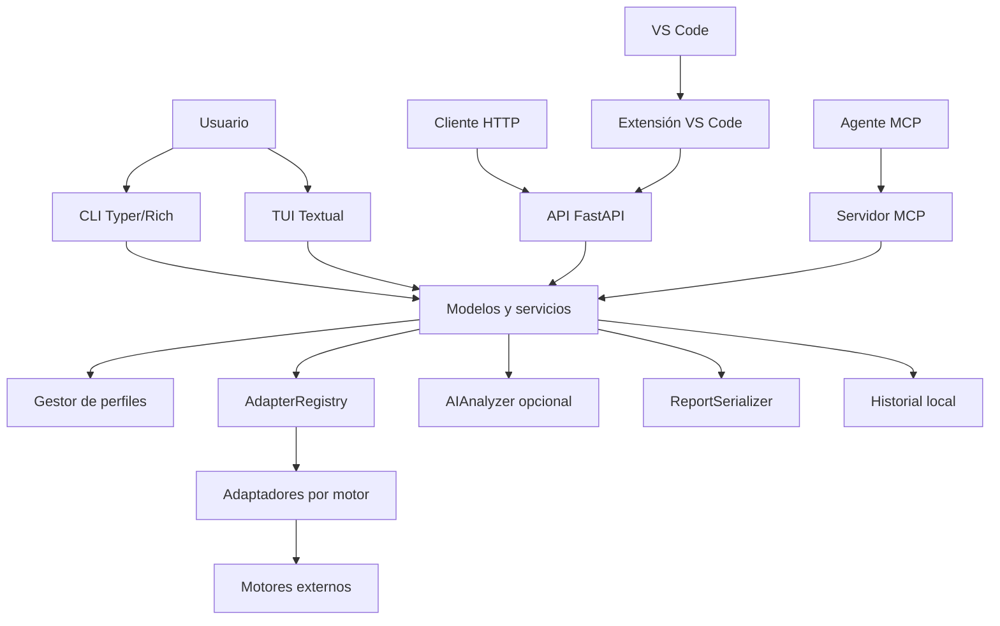

## 3.4. Vista de procesos

La vista de procesos presenta el flujo operativo principal. La arquitectura debe asegurar
validación, conexión, ejecución, reporte, cierre de recursos y respuesta segura.

### 3.4.1. Diagrama de Procesos del sistema (diagrama de actividad)

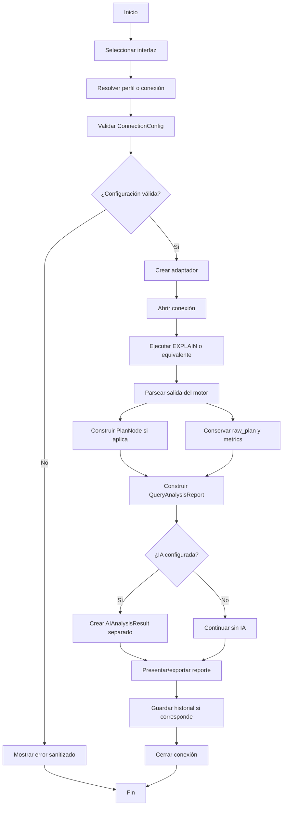

## 3.5. Vista de Despliegue (vista física)

La vista de despliegue muestra los nodos físicos y entornos donde opera Query Analyzer.
La aplicación puede ejecutarse desde código fuente, binario distribuido, API local,
extensión VS Code o servidor MCP.

### 3.5.1. Diagrama de despliegue

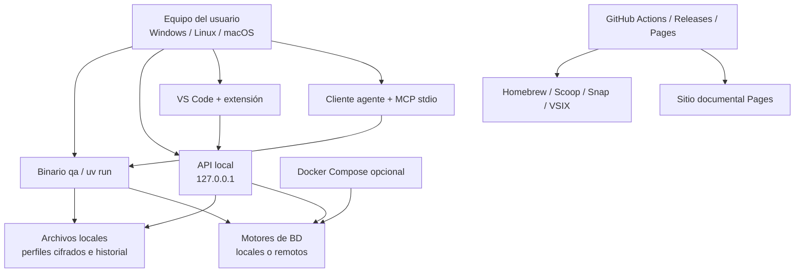

\pagebreak

# 4. ATRIBUTOS DE CALIDAD DEL SOFTWARE

Los atributos de calidad se expresan como escenarios verificables. Cada escenario indica
estímulo, ambiente, respuesta esperada y medida de aceptación.

## Escenario de Funcionalidad

| Elemento | Descripción |
|---|---|
| Estímulo | Un usuario solicita analizar una consulta en un motor soportado |
| Ambiente | CLI, TUI, API, MCP o VS Code con conexión válida |
| Respuesta | El sistema crea el adaptador, ejecuta el mecanismo de análisis y devuelve `QueryAnalysisReport` |
| Medida | El reporte contiene motor, consulta, tiempo mayor que cero, resumen, fecha, métricas disponibles y plan original si existe |

## Escenario de Usabilidad

| Elemento | Descripción |
|---|---|
| Estímulo | Un estudiante necesita diagnosticar una consulta sin conocer todos los comandos del motor |
| Ambiente | Equipo local con perfil configurado |
| Respuesta | El sistema guía la selección de perfil, ejecuta el análisis y presenta resultados legibles |
| Medida | El usuario obtiene el reporte desde CLI/TUI o VS Code sin manipular directamente el driver |

## Escenario de confiabilidad

| Elemento | Descripción |
|---|---|
| Estímulo | El proveedor de IA no está configurado o falla durante el análisis |
| Ambiente | Análisis factual ya ejecutado contra un motor |
| Respuesta | El sistema omite `AIAnalysisResult` y conserva el reporte factual |
| Medida | La operación no falla por ausencia de IA y no altera métricas reales |

## Escenario de rendimiento

| Elemento | Descripción |
|---|---|
| Estímulo | El usuario ejecuta un análisis desde CLI o API local |
| Ambiente | Motor accesible y consulta válida |
| Respuesta | El sistema delega el trabajo al adaptador sin pasar por capas innecesarias |
| Medida | El tiempo reportado corresponde al análisis observado y el cierre de conexión se ejecuta al finalizar |

## Escenario de mantenibilidad

| Elemento | Descripción |
|---|---|
| Estímulo | Se requiere añadir un nuevo motor soportado |
| Ambiente | Código fuente del proyecto y contrato `BaseAdapter` |
| Respuesta | Se implementa un adaptador nuevo, se registra en `AdapterRegistry` y se agregan pruebas |
| Medida | Las interfaces superiores no necesitan cambiar para crear el adaptador y consumir `QueryAnalysisReport` |

## Otros Escenarios

### Seguridad

| Elemento | Descripción |
|---|---|
| Estímulo | Ocurre un error de conexión con URI, token o contraseña |
| Ambiente | CLI, TUI o API |
| Respuesta | El sistema devuelve mensaje comprensible y sanitizado |
| Medida | No aparecen contraseñas, tokens, API keys ni cabeceras Bearer en respuestas públicas |

### Portabilidad

| Elemento | Descripción |
|---|---|
| Estímulo | Un usuario instala Query Analyzer en Windows, Linux o macOS |
| Ambiente | Binario, gestor de paquetes o código fuente con `uv` |
| Respuesta | El sistema ejecuta los mismos comandos principales y conserva el contrato de reporte |
| Medida | CLI, API y extensión pueden operar sin cambiar el diseño de adaptadores |

### Interoperabilidad

| Elemento | Descripción |
|---|---|
| Estímulo | Una herramienta externa necesita consumir análisis de consultas |
| Ambiente | API REST local o MCP por stdio |
| Respuesta | El sistema entrega datos estructurados sin depender de la presentación CLI/TUI |
| Medida | Clientes HTTP y agentes MCP reciben reportes compatibles con los modelos documentados |

### Trazabilidad documental

| Elemento | Descripción |
|---|---|
| Estímulo | El docente o equipo revisa evidencias del proyecto |
| Ambiente | GitHub Pages generado desde Markdown |
| Respuesta | La documentación institucional, reportes y enlaces se renderizan de forma navegable |
| Medida | `scripts/build-pages.py` genera el sitio sin Markdown crudo en portadas ni enlaces rotos relevantes |
