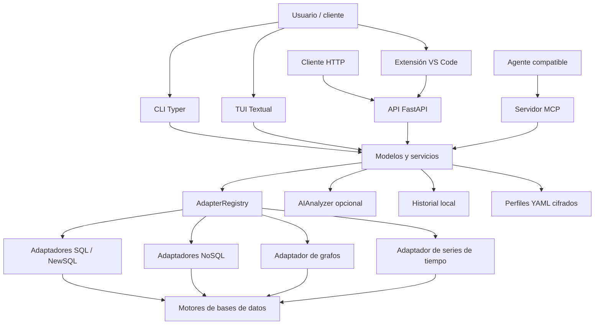

**UNIVERSIDAD PRIVADA DE TACNA**

**FACULTAD DE INGENIERÍA**

**Escuela Profesional de Ingeniería de Sistemas**

**Informe Final de Proyecto**

**Sistema Analizador de Rendimiento de Consultas (Query Analyzer)**

Curso: *Base de Datos II*

Docente: *Patrick Cuadros Quiroga*

Integrantes:

***Carbajal Vargas, Andre Alejandro (2023077287)***

***Yupa Gómez, Fátima Sofía (2023076618)***

**Tacna - Perú**

***2026***

\pagebreak

Sistema *Analizador de Rendimiento de Consultas (Query Analyzer)*

Informe Final de Proyecto

Versión *1.2*

| CONTROL DE VERSIONES | | | | | |
|:---:|:---|:---|:---|:---:|:---|
| Versión | Hecha por | Revisada por | Aprobada por | Fecha | Motivo |
| 1.0 | ACV, FYG | ACV, FYG | P. Cuadros Q. | 2026-06-23 | Elaboración del informe final para Query Analyzer 2.3.1 |
| 1.1 | ACV, FYG | ACV, FYG | P. Cuadros Q. | 2026-06-23 | Unificación institucional y ampliación de evidencias de calidad |
| 1.2 | ACV, FYG | ACV, FYG | P. Cuadros Q. | 2026-07-04 | Ajuste final según FD01, FD02, FD03, FD04 y estructura de anexos |

\pagebreak

# ÍNDICE GENERAL

1. [Antecedentes](#1-antecedentes)
2. [Planteamiento del Problema](#2-planteamiento-del-problema)
   1. [Problema](#a-problema)
   2. [Justificación](#b-justificación)
   3. [Alcance](#c-alcance)
3. [Objetivos](#3-objetivos)
4. [Marco Teórico](#4-marco-teórico)
5. [Desarrollo de la Solución](#5-desarrollo-de-la-solución)
   1. [Análisis de Factibilidad](#a-análisis-de-factibilidad)
   2. [Tecnología de Desarrollo](#b-tecnología-de-desarrollo)
   3. [Metodología de implementación](#c-metodología-de-implementación)
6. [Cronograma](#6-cronograma)
7. [Presupuesto](#7-presupuesto)
8. [Conclusiones](#8-conclusiones)
9. [Recomendaciones](#recomendaciones)
10. [Bibliografía](#bibliografía)
11. [Anexos](#anexos)
    1. [Anexo 01 Informe de Factibilidad](#anexo-01-informe-de-factibilidad)
    2. [Anexo 02 Documento de Visión](#anexo-02-documento-de-visión)
    3. [Anexo 03 Documento SRS](#anexo-03-documento-srs)
    4. [Anexo 04 Documento SAD](#anexo-04-documento-sad)
    5. [Anexo 05 Manuales y otros documentos](#anexo-05-manuales-y-otros-documentos)

\pagebreak

# 1. Antecedentes

El rendimiento de las consultas es un factor determinante en la capacidad de respuesta,
estabilidad y costo operativo de los sistemas de información. Los motores de bases de
datos ofrecen mecanismos como `EXPLAIN`, `EXPLAIN ANALYZE`, perfiles de ejecución,
estadísticas de lectura, trazas, planes JSON, registros de operaciones lentas y métricas
específicas. Sin embargo, cada tecnología utiliza comandos y formatos distintos.

En escenarios donde se trabaja con PostgreSQL, MySQL, SQLite, Microsoft SQL Server,
CockroachDB, YugabyteDB, MongoDB, Redis, DynamoDB, Cassandra, Elasticsearch, Neo4j o
InfluxDB, el usuario debe cambiar de herramienta, interpretar salidas heterogéneas y
evitar comparaciones incorrectas entre métricas que no tienen la misma semántica. Este
proceso incrementa el tiempo de diagnóstico y dificulta la generación de evidencia
reproducible para justificar optimizaciones.

El proyecto **Query Analyzer** se inició el **4 de abril de 2026** como una herramienta
académica, local, multiplataforma y extensible para centralizar ese proceso. La solución
evolucionó desde una arquitectura básica de adaptadores hasta integrar:

- interfaz de línea de comandos (CLI);
- interfaz interactiva en terminal (TUI);
- API REST local con FastAPI;
- servidor MCP para agentes y asistentes de programación;
- extensión para Visual Studio Code;
- adaptadores para motores SQL, NoSQL, grafos, series de tiempo y servicios cloud;
- exportación de reportes estructurados;
- análisis opcional mediante proveedores de inteligencia artificial.

El principio central de la versión actual es la **separación entre evidencia e
interpretación**. El núcleo reporta datos obtenidos del motor o derivados estructuralmente
del plan. La interpretación de IA, cuando se habilita, se presenta en una sección
independiente y no modifica métricas, plan original ni conclusiones factuales.

\pagebreak

# 2. Planteamiento del Problema

## a. Problema

Los desarrolladores, estudiantes y administradores de bases de datos que analizan
consultas en más de un motor enfrentan una fragmentación considerable:

1. Cada motor utiliza una sintaxis distinta para explicar o perfilar una operación.
2. Los planes pueden presentarse como árboles JSON, tablas, texto, etapas documentales o
   métricas propias.
3. El significado de una métrica no siempre es comparable entre motores.
4. Las credenciales suelen mantenerse en múltiples scripts o herramientas.
5. La evidencia queda dispersa y es difícil de exportar o reutilizar.
6. Las recomendaciones automáticas pueden confundirse con hechos si no se separan del
   plan real.

La pregunta que orientó el proyecto fue:

> ¿Cómo construir una herramienta local, extensible y segura que permita obtener y
> presentar planes y métricas reales de múltiples motores de bases de datos mediante una
> experiencia uniforme, sin mezclar la evidencia factual con interpretaciones opcionales?

## b. Justificación

La implementación de Query Analyzer se justifica por los siguientes criterios:

- **Académico:** permite estudiar cómo distintos motores planifican y ejecutan consultas.
- **Técnico:** proporciona una abstracción común sin ocultar el plan original.
- **Operativo:** reduce comandos manuales y centraliza perfiles de conexión.
- **Seguridad:** cifra credenciales locales y sanitiza errores.
- **Interoperabilidad:** ofrece CLI, TUI, API REST, MCP, VS Code, JSON y Markdown.
- **Mantenibilidad:** el patrón Adapter permite añadir motores sin cambiar el flujo
  principal.
- **Económico:** usa herramientas abiertas y no requiere infraestructura comercial.
- **Calidad:** incorpora lint, formato, tipado, pruebas y automatización de evidencias.

## c. Alcance

### Incluido

- Administración de perfiles de conexión locales.
- Cifrado de credenciales persistidas.
- Diagnóstico progresivo de configuración, conectividad, autenticación y operación.
- Registro y creación dinámica de adaptadores.
- Ejecución de `EXPLAIN` o mecanismo equivalente.
- Normalización parcial de planes mediante `PlanNode`.
- Construcción de `QueryAnalysisReport` factual.
- Conservación de `raw_plan` y métricas específicas.
- Exportación a JSON y Markdown.
- Historial local de análisis por perfil.
- Interfaces CLI, TUI, API REST, MCP y VS Code.
- Interpretación opcional mediante IA compatible con API tipo OpenAI.
- Distribución mediante binarios, GitHub Releases, Homebrew, Scoop, Snap y VSIX.

### Motores soportados

| Categoría | Motores |
|---|---|
| SQL y NewSQL | PostgreSQL, MySQL, SQLite, Microsoft SQL Server, CockroachDB y YugabyteDB |
| NoSQL | MongoDB, Redis, DynamoDB, Cassandra y Elasticsearch |
| Grafos | Neo4j |
| Series de tiempo | InfluxDB |

### Fuera de alcance

- Modificar consultas, índices o esquemas automáticamente.
- Reemplazar una plataforma APM o de monitoreo continuo.
- Garantizar que una sugerencia de IA mejore el rendimiento.
- Generar una puntuación universal de calidad.
- Comparar como equivalentes métricas incompatibles.
- Persistir credenciales recibidas por API REST.
- Ejecutar consultas destructivas como parte del flujo normal.

\pagebreak

# 3. Objetivos

## 3.1. Objetivo general

Desarrollar una herramienta multiplataforma y extensible que permita analizar planes de
ejecución y métricas observables de consultas en múltiples motores de bases de datos,
presentando la evidencia mediante interfaces uniformes y manteniendo separada cualquier
interpretación opcional generada por inteligencia artificial.

## 3.2. Objetivos específicos

1. Diseñar una arquitectura modular basada en capas y en el patrón Adapter.
2. Implementar un contrato común para conexión, diagnóstico, análisis y métricas.
3. Normalizar la estructura jerárquica de planes sin eliminar el contenido original.
4. Gestionar perfiles locales con cifrado de credenciales.
5. Proporcionar CLI y TUI para diferentes niveles de interacción.
6. Exponer el núcleo funcional mediante API REST local y servidor MCP.
7. Integrar el análisis desde Visual Studio Code.
8. Exportar resultados reproducibles en JSON y Markdown.
9. Implementar pruebas automatizadas y controles de calidad.
10. Automatizar construcción y publicación de versiones multiplataforma.

\pagebreak

# 4. Marco Teórico

## 4.1. Plan de ejecución

Un plan de ejecución describe las operaciones seleccionadas por el optimizador para
resolver una consulta. Puede incluir exploraciones secuenciales, búsquedas por índice,
uniones, ordenamientos, agregaciones, filtros, estimaciones de filas y tiempos
observados.

## 4.2. EXPLAIN y mecanismos equivalentes

Los motores relacionales suelen ofrecer variantes de `EXPLAIN`. MongoDB expone planes
mediante `.explain()`, Elasticsearch dispone de profiling, Neo4j utiliza `EXPLAIN` y
`PROFILE`, Redis permite revisar operaciones lentas, y otros motores entregan estadísticas
o metadatos equivalentes.

## 4.3. Patrón Adapter

El patrón Adapter permite presentar una interfaz estable sobre componentes con APIs
incompatibles. En Query Analyzer, `BaseAdapter` define operaciones comunes y
`AdapterRegistry` registra las implementaciones concretas.

## 4.4. Normalización de datos

La normalización no convierte métricas a una escala común. Su objetivo es representar
jerarquías mediante `PlanNode`, conservar valores opcionales y mantener propiedades
particulares del motor. Los valores inexistentes permanecen como `None` o se omiten.

## 4.5. Seguridad de credenciales

Los perfiles se almacenan localmente y las contraseñas se cifran antes de escribirse en
disco. Los diagnósticos y errores aplican sanitización para ocultar contraseñas, tokens,
API keys, cabeceras Bearer y secretos presentes en URI.

## 4.6. API REST, MCP e IA asistiva

La API REST usa FastAPI y modelos Pydantic para validar solicitudes y respuestas. El
servidor MCP expone `analyze_query(query, profile)` para agentes compatibles. La IA
recibe plan, consulta y motor, y produce `AIAnalysisResult` separado del reporte factual.

## 4.7. Calidad de software

El proyecto adopta prácticas alineadas con mantenibilidad, portabilidad, confiabilidad,
seguridad e interoperabilidad: tipado estático, pruebas automatizadas, formato
determinista, contratos de datos, separación de responsabilidades y CI/CD.

\pagebreak

# 5. Desarrollo de la Solución

## a. Análisis de Factibilidad

### Factibilidad técnica

La solución es técnicamente viable porque Python dispone de drivers maduros, Pydantic
proporciona contratos consistentes, Typer/Rich/Textual cubren interfaces de terminal,
FastAPI expone el núcleo por HTTP, Docker Compose facilita pruebas con servicios reales y
el patrón Adapter contiene la heterogeneidad de motores.

### Factibilidad económica

El stack principal es de código abierto y no exige licencias comerciales. Los costos se
concentran en tiempo del equipo, conectividad, energía y gastos menores. La distribución
por GitHub, gestores de paquetes y VSIX se mantiene viable para el contexto académico.

### Factibilidad operativa

El usuario puede instalar un binario, crear un perfil, verificar la conexión, analizar una
consulta y exportar resultados sin preparar un entorno de desarrollo. La extensión de VS
Code reduce fricción para usuarios del editor.

### Factibilidad social

La solución facilita el aprendizaje de planes de ejecución, democratiza herramientas de
diagnóstico y evita presentar recomendaciones automáticas como hechos.

### Factibilidad legal

El proyecto usa dependencias con licencias abiertas y no necesita almacenar datos en un
servidor externo. El tratamiento de credenciales y consultas debe mantenerse alineado con
la Ley N.° 29733 de Protección de Datos Personales cuando exista información personal.

### Factibilidad ambiental

El impacto directo es reducido porque la aplicación se ejecuta localmente y no requiere un
servidor permanente. Indirectamente, la optimización de consultas puede disminuir consumo
de CPU, memoria, disco, red y recursos cloud.

## b. Tecnología de Desarrollo

| Capa o propósito | Tecnología | Uso en el proyecto |
|---|---|---|
| Lenguaje | Python 3.14+ | Núcleo, adaptadores, CLI, TUI, API y MCP |
| Gestión de dependencias | uv | Sincronización y ejecución reproducible |
| Modelos y validación | Pydantic 2 | Configuración, reportes y contratos REST |
| CLI | Typer | Comandos `qa`, `analyze`, `profile` y `api` |
| Salida en terminal | Rich | Tablas, paneles, árboles y mensajes |
| TUI | Textual | Interfaz interactiva e historial |
| API | FastAPI + Uvicorn | Servicio REST local |
| MCP | SDK MCP | Integración con agentes |
| Seguridad | cryptography | Cifrado de contraseñas |
| Configuración | PyYAML | Persistencia de perfiles |
| Testing | pytest, pytest-cov | Pruebas unitarias, contrato e integración |
| Calidad | Ruff y mypy | Lint, formato y tipado |
| Infraestructura | Docker Compose | Motores para integración |
| Extensión | TypeScript + VS Code API | Integración con el editor |
| Empaquetado | PyInstaller, JReleaser y VSCE | Binarios, gestores y VSIX |
| Automatización | GitHub Actions | CI, releases, reportes y Pages |

## c. Metodología de implementación

La implementación siguió un enfoque incremental por entregables. Cada fase produjo una
capacidad verificable y se documentó mediante los informes académicos del proyecto:
Documento de Visión (FD02), SRS o especificación de requerimientos (FD03) y SAD o
arquitectura de software (FD04).

| Fase | Periodo aproximado | Actividades principales | Documento relacionado |
|---|---|---|---|
| Inicio y visión | 04-10 abril 2026 | Problema, usuarios, alcance y capacidades | FD02 - Documento de Visión |
| Requerimientos | Abril 2026 | RF, RNF, reglas, casos de uso y modelos | FD03 - Documento SRS |
| Arquitectura | Abril 2026 | Capas, adaptadores, vistas 4+1 y despliegue | FD04 - Documento SAD |
| Adaptadores SQL/NewSQL | Abril-mayo 2026 | PostgreSQL, MySQL, SQLite, SQL Server, CockroachDB y YugabyteDB | Código y pruebas |
| Motores especializados | Mayo 2026 | MongoDB, Redis, DynamoDB, Cassandra, Elasticsearch, Neo4j e InfluxDB | Código y pruebas |
| Interfaces | Mayo-junio 2026 | CLI, TUI, API REST, MCP y VS Code | Manuales y documentación técnica |
| Calidad y publicación | Junio-julio 2026 | Pruebas, Pages, release, evidencias e informes finales | FD01-FD05 y anexos |

### Arquitectura implementada

### Módulos y funcionalidades

| Módulo | Responsabilidad principal |
|---|---|
| `query_analyzer/adapters/` | Contrato, registro, modelos, serialización y adaptadores |
| `query_analyzer/config/` | Perfiles, defaults, YAML y cifrado |
| `query_analyzer/core/` | Diagnóstico de conexiones e IA opcional |
| `query_analyzer/cli/` | Comandos y presentación de consola |
| `query_analyzer/tui/` | Aplicación interactiva, historial y widgets |
| `query_analyzer/api/` | Endpoints y esquemas REST |
| `query_analyzer/mcp_server.py` | Herramienta MCP |
| `integrations/vscode-query-analyzer/` | Extensión de VS Code |

### Calidad, pruebas y resultados

| Control | Herramienta | Resultado documentado |
|---|---|---|
| Lint | Ruff | Aprobado |
| Formato | Ruff Format | Aprobado |
| Tipado estático | mypy | Sin incidencias en el paquete principal |
| Pruebas unitarias y contrato | pytest | Motores y modelos verificados |
| Pruebas de integración | pytest + Docker | Servicios reales o emulados por motor |
| Extensión VS Code | Node Test Runner | Pruebas TypeScript |
| Documentación | GitHub Pages | Informes institucionales y evidencias |

### Despliegue y distribución

La solución se distribuye mediante binarios por plataforma, GitHub Releases, Homebrew,
Scoop, Snap y archivos VSIX. El workflow de release construye ejecutables, empaqueta la
extensión, genera checksums y publica artefactos. La documentación se genera con
`scripts/build-pages.py` y se publica como sitio estático.

\pagebreak

# 6. Cronograma

| Actividad | Abril | Mayo | Junio | Julio | Estado |
|---|:---:|:---:|:---:|:---:|---|
| Configuración inicial y visión | X |  |  |  | Completado |
| Requerimientos y arquitectura | X |  |  |  | Completado |
| Modelos, perfiles y cifrado | X | X |  |  | Completado |
| Adaptadores SQL y NewSQL | X | X |  |  | Completado |
| Adaptadores NoSQL, grafos y series de tiempo |  | X | X |  | Completado |
| CLI y TUI | X | X |  |  | Completado |
| API REST e IA opcional |  |  | X |  | Completado |
| MCP y extensión VS Code |  |  | X |  | Completado |
| Pruebas y controles de calidad | X | X | X | X | Completado y continuo |
| Documentación final FD01-FD05 |  |  | X | X | Completado |

\pagebreak

# 7. Presupuesto

El presupuesto conserva la estimación académica del informe de factibilidad. El mayor
componente corresponde a horas de desarrollo e investigación; las herramientas utilizadas
no generan costo de licencia.

## 7.1. Costos operativos

| Concepto | Meses | Costo mensual | Total |
|---|:---:|---:|---:|
| Servicio de internet | 4 | S/ 40.00 | S/ 160.00 |
| Energía eléctrica | 4 | S/ 25.00 | S/ 100.00 |
| **Total operativo** |  |  | **S/ 260.00** |

## 7.2. Costos de ambiente

| Recurso | Modalidad | Costo |
|---|---|---:|
| Python, uv y librerías | Código abierto | S/ 0.00 |
| Docker para uso académico | Gratuito | S/ 0.00 |
| GitHub, GitHub Actions y Pages | Plan gratuito | S/ 0.00 |
| Visual Studio Code | Gratuito | S/ 0.00 |
| PyPI y GitHub Releases | Gratuito | S/ 0.00 |
| **Total de ambiente** |  | **S/ 0.00** |

## 7.3. Costos valorizados de personal

| Concepto | Horas estimadas | Valor hora | Total |
|---|---:|---:|---:|
| Análisis, diseño y arquitectura | 70.0 | S/ 15.00 | S/ 1,050.00 |
| Implementación de adaptadores | 170.0 | S/ 15.00 | S/ 2,550.00 |
| CLI, TUI, API e integraciones | 127.5 | S/ 15.00 | S/ 1,912.50 |
| Pruebas, distribución y documentación | 73.5 | S/ 15.00 | S/ 1,102.50 |
| **Total de personal** | **441.0** |  | **S/ 6,615.00** |

## 7.4. Resumen

| Categoría | Monto |
|---|---:|
| Costos operativos | S/ 260.00 |
| Costos de ambiente | S/ 0.00 |
| Costos valorizados de personal | S/ 6,615.00 |
| Contingencia y gastos menores | S/ 231.50 |
| **Presupuesto total estimado** | **S/ 7,106.50** |

\pagebreak

# 8. Conclusiones

1. Query Analyzer alcanzó una solución funcional, modular y multiplataforma para obtener
   evidencia de rendimiento en motores de distintos paradigmas.
2. El patrón Adapter permitió incorporar 13 motores bajo un contrato común sin acoplar
   las interfaces de usuario a drivers concretos.
3. La decisión de eliminar el score universal y separar la IA de los datos factuales
   incrementa la transparencia del reporte.
4. La herramienta ofrece más de una vía de uso: CLI, TUI, API REST, MCP y extensión de VS
   Code.
5. La gestión cifrada de perfiles y la sanitización de mensajes reducen el riesgo de
   exposición de credenciales.
6. Los controles de lint, formato, tipado y pruebas demuestran una base de calidad
   verificable.
7. La automatización de releases permite entregar binarios y extensiones por plataforma.
8. El proyecto es técnica, operativa, económica, legal, social y ambientalmente viable en
   el contexto académico planteado.

# Recomendaciones

1. Mantener sincronizados FD01, FD02, FD03, FD04 y FD05 con cada release relevante.
2. Ejecutar la suite de integración con Docker antes de releases mayores.
3. Publicar una matriz de compatibilidad que indique profundidad funcional por adaptador.
4. Añadir versionado explícito del historial local si su esquema cambia.
5. Ampliar el diccionario de métricas específicas por motor con ejemplos reales.
6. Mantener la API enlazada a localhost por defecto mientras no exista autenticación para
   exposición en red.
7. Registrar telemetría solo si es opt-in, anónima y documentada.
8. Continuar mejorando mensajes en español y documentación para usuarios no
   especializados.

\pagebreak

# Bibliografía

1. Bass, L., Clements, P., & Kazman, R. (2021). *Software Architecture in Practice*.
2. Fowler, M. (2002). *Patterns of Enterprise Application Architecture*.
3. Gamma, E., Helm, R., Johnson, R., & Vlissides, J. (1994). *Design Patterns*.
4. Kleppmann, M. (2017). *Designing Data-Intensive Applications*.
5. Pressman, R. S., & Maxim, B. R. (2020). *Software Engineering: A Practitioner's Approach*.
6. Sommerville, I. (2016). *Software Engineering*.
7. ISO/IEC 25010:2011. *Systems and software quality models*.
8. Ley N.° 29733. Ley de Protección de Datos Personales del Perú.

## Fuentes web consultadas

- Python: <https://docs.python.org/3/>
- uv: <https://docs.astral.sh/uv/>
- Pydantic: <https://docs.pydantic.dev/>
- Typer: <https://typer.tiangolo.com/>
- Rich: <https://rich.readthedocs.io/>
- Textual: <https://textual.textualize.io/>
- FastAPI: <https://fastapi.tiangolo.com/>
- PostgreSQL EXPLAIN: <https://www.postgresql.org/docs/current/using-explain.html>
- MySQL EXPLAIN: <https://dev.mysql.com/doc/refman/8.0/en/explain.html>
- MongoDB Explain Results: <https://www.mongodb.com/docs/manual/reference/explain-results/>
- Neo4j Execution Plans: <https://neo4j.com/docs/cypher-manual/current/planning-and-tuning/execution-plans/>
- GitHub Actions: <https://docs.github.com/actions>
- Visual Studio Code Extension API: <https://code.visualstudio.com/api>
- Model Context Protocol: <https://modelcontextprotocol.io/>

\pagebreak

# Anexos

## Anexo 01 Informe de Factibilidad

Documento **FD01 - Informe de Factibilidad**, con evaluación técnica, económica,
operativa, social, legal, ambiental y análisis financiero del proyecto.

## Anexo 02 Documento de Visión

Documento **FD02 - Informe de Visión**, con usuarios, capacidades, principios, alcance y
resultado esperado del sistema.

## Anexo 03 Documento SRS

Documento **FD03 - Especificación de Requerimientos**, con requerimientos funcionales, no
funcionales, reglas de negocio, procesos, casos de uso, diagramas de secuencia por caso de
uso y modelo lógico.

## Anexo 04 Documento SAD

Documento **FD04 - Informe de Arquitectura de Software**, con vistas 4+1, componentes,
procesos, despliegue físico y atributos de calidad.

## Anexo 05 Manuales y otros documentos

Documentos complementarios del proyecto:

- `README.md`
- `CONTRIBUTING.md`
- `docs/API.md`
- `docs/Manual-de-Usuario.md`
- `docs/VS_CODE_EXTENSION.md`
- `docs/Estandar-de-Programacion.md`
- `docs/DICCIONARIO-DE-DATOS.md`
- `docs/Github-Project-y-Trazabilidad.md`
- `docs/Calidad-y-Evidencias.md`
- `TESTING_WITH_SEED_DATA.md`
