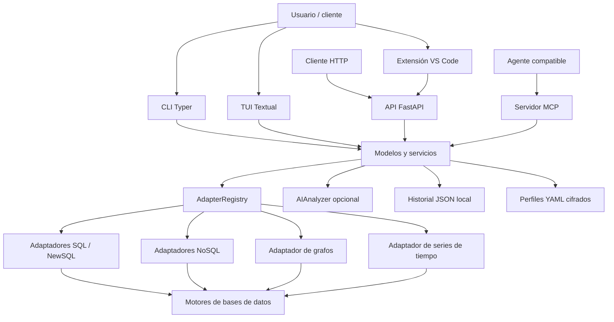
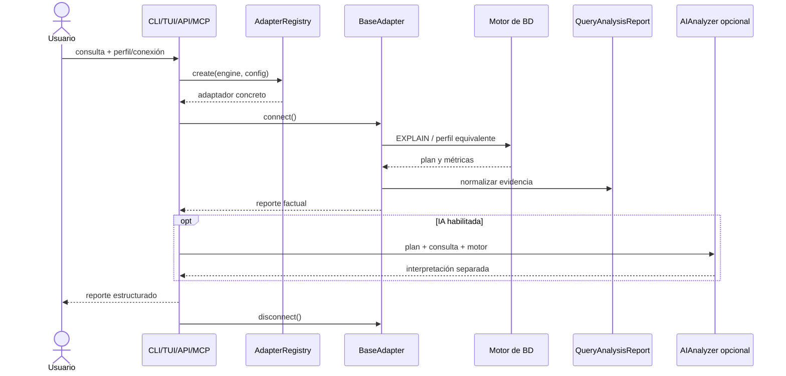

**UNIVERSIDAD PRIVADA DE TACNA**

**FACULTAD DE INGENIERÍA**

**Escuela Profesional de Ingeniería de Sistemas**

 

# INFORME FINAL

## PROYECTO: ANALIZADOR DE RENDIMIENTO DE CONSULTAS

**Sistema Query Analyzer**

 

**Curso:** Base de Datos II

**Docente:** Mag. Patrick Cuadros Quiroga

**Integrantes:**

**Carbajal Vargas, Andre Alejandro (2023077287)**

**Yupa Gómez, Fátima Sofía (2023076618)**

 

**Tacna – Perú**

**2026**

# CONTROL DE VERSIONES

| Versión | Elaborado por | Revisado por | Aprobado por | Fecha | Motivo |
|:---:|---|---|---|:---:|---|
| 1.0 | AACV / FSYG | AACV / FSYG | Mag. Patrick Cuadros Quiroga | 23/06/2026 | Elaboración del informe final conforme al estado de Query Analyzer 2.3.1 |

# ÍNDICE GENERAL

1. [Antecedentes](#1-antecedentes)
2. [Planteamiento del problema](#2-planteamiento-del-problema)
   1. [Problema](#21-problema)
   2. [Justificación](#22-justificación)
   3. [Alcance](#23-alcance)
3. [Objetivos](#3-objetivos)
4. [Marco teórico](#4-marco-teórico)
5. [Desarrollo de la solución](#5-desarrollo-de-la-solución)
   1. [Análisis de factibilidad](#51-análisis-de-factibilidad)
   2. [Tecnología de desarrollo](#52-tecnología-de-desarrollo)
   3. [Metodología de implementación](#53-metodología-de-implementación)
   4. [Arquitectura implementada](#54-arquitectura-implementada)
   5. [Módulos y funcionalidades](#55-módulos-y-funcionalidades)
   6. [Calidad, pruebas y resultados](#56-calidad-pruebas-y-resultados)
   7. [Despliegue y distribución](#57-despliegue-y-distribución)
6. [Cronograma](#6-cronograma)
7. [Presupuesto](#7-presupuesto)
8. [Conclusiones](#8-conclusiones)
9. [Recomendaciones](#9-recomendaciones)
10. [Bibliografía](#10-bibliografía)
11. [Webgrafía](#11-webgrafía)
12. [Anexos](#12-anexos)

# 1. Antecedentes

El rendimiento de las consultas es un factor determinante en la capacidad de respuesta, estabilidad
y costo operativo de los sistemas de información. Los motores de bases de datos ofrecen mecanismos
como `EXPLAIN`, `EXPLAIN ANALYZE`, perfiles de ejecución, estadísticas de lectura y registros de
operaciones lentas. Sin embargo, cada tecnología utiliza comandos, estructuras y métricas diferentes.

En un entorno que combine PostgreSQL, MySQL, SQLite, MongoDB, Redis, Neo4j, InfluxDB u otros
motores, el desarrollador debe conocer la sintaxis particular de cada plataforma, interpretar planes
heterogéneos y reunir manualmente la evidencia necesaria para justificar una optimización. Este
proceso incrementa el tiempo de diagnóstico y favorece interpretaciones incorrectas, especialmente
en contextos académicos o equipos sin un administrador de bases de datos dedicado.

El proyecto **Query Analyzer** se inició el 4 de abril de 2026 como una herramienta local,
multiplataforma y extensible para centralizar ese proceso. La solución evolucionó desde una
arquitectura básica de adaptadores hasta la versión **2.3.1**, que integra:

- interfaz de línea de comandos (CLI);
- interfaz interactiva en terminal (TUI);
- API REST local construida con FastAPI;
- servidor MCP para agentes y asistentes de programación;
- extensión para Visual Studio Code;
- adaptadores para motores SQL, NoSQL, grafos, series de tiempo y servicios cloud;
- exportación de reportes estructurados;
- análisis opcional mediante proveedores de inteligencia artificial.

La evolución del producto tomó como referencia prácticas ya empleadas en el proyecto académico
**Analizador de Dependencias Multi-Lenguaje**, principalmente la organización modular, el uso de una
CLI como interfaz principal, la automatización de pruebas, el versionado semántico, la distribución
multiplataforma y la documentación trazable.

El principio central de la versión actual es la **separación entre evidencia e interpretación**. El
núcleo reporta únicamente datos obtenidos del motor o derivados estructuralmente del plan. La
interpretación en lenguaje natural, cuando se habilita, se presenta en una sección independiente y
se identifica explícitamente como contenido generado por IA.

# 2. Planteamiento del problema

## 2.1. Problema

Los desarrolladores, estudiantes y administradores de bases de datos que trabajan con más de un
motor enfrentan una fragmentación considerable al analizar consultas:

1. Cada motor utiliza una sintaxis distinta para explicar o perfilar una operación.
2. Los planes pueden presentarse como árboles JSON, tablas, texto, etapas documentales o métricas
   específicas.
3. El significado de un mismo concepto no siempre es comparable entre motores.
4. Las credenciales suelen mantenerse en múltiples herramientas o scripts.
5. La evidencia de una ejecución queda dispersa y resulta difícil de exportar o reutilizar.
6. Las recomendaciones automáticas pueden confundirse con hechos si no se separan del plan real.

Como resultado, el diagnóstico manual requiere tiempo, conocimiento especializado y cambios
constantes de herramienta. Además, existe el riesgo de inventar métricas ausentes, comparar valores
incompatibles o exponer credenciales en registros y mensajes de error.

La pregunta que orientó el proyecto fue:

> ¿Cómo construir una herramienta local, extensible y segura que permita obtener y presentar planes
> y métricas reales de múltiples motores de bases de datos mediante una experiencia uniforme, sin
> mezclar la evidencia factual con interpretaciones opcionales?

## 2.2. Justificación

La implementación se justifica por los siguientes motivos:

- **Académico:** permite estudiar cómo distintos motores planifican y ejecutan consultas mediante
  evidencia reproducible.
- **Técnico:** proporciona una abstracción común sin ocultar el plan original ni las propiedades
  particulares de cada tecnología.
- **Operativo:** reduce la cantidad de comandos y aplicaciones que el usuario debe dominar.
- **Seguridad:** centraliza perfiles cifrados y sanitiza secretos en errores y diagnósticos.
- **Interoperabilidad:** ofrece CLI, TUI, API REST, MCP, JSON, Markdown y extensión de VS Code.
- **Mantenibilidad:** el patrón Adapter permite añadir motores sin modificar el flujo principal.
- **Económico:** emplea herramientas de código abierto y puede ejecutarse sin infraestructura
  comercial.
- **Calidad:** incorpora linting, formato, tipado estático, pruebas unitarias, pruebas de integración
  y automatización de releases.

## 2.3. Alcance

### Incluido

- Administración de perfiles de conexión locales.
- Cifrado de contraseñas almacenadas.
- Diagnóstico progresivo de configuración, conectividad TCP, autenticación y operatividad.
- Registro y creación dinámica de adaptadores.
- Ejecución de `EXPLAIN` o mecanismo equivalente.
- Normalización de planes mediante `PlanNode`.
- Construcción de reportes factuales mediante `QueryAnalysisReport`.
- Conservación del plan original y las métricas específicas del motor.
- Exportación de reportes a JSON y Markdown.
- Historial local de análisis por perfil.
- Interfaz CLI y TUI.
- API REST versionada bajo `/api/v1/analyzer`.
- Servidor MCP con la herramienta `analyze_query`.
- Extensión de Visual Studio Code con backend local empaquetado.
- Análisis opcional por IA con proveedores compatibles con API tipo OpenAI.
- Distribución mediante binarios, GitHub Releases, Homebrew, Scoop, Snap y VSIX.

### Motores contemplados por el modelo y los adaptadores

| Categoría | Motores |
|---|---|
| SQL y NewSQL | PostgreSQL, MySQL, SQLite, Microsoft SQL Server, CockroachDB y YugabyteDB |
| NoSQL | MongoDB, Redis, DynamoDB, Cassandra y Elasticsearch |
| Grafos | Neo4j |
| Series de tiempo | InfluxDB |

### Fuera de alcance

- Modificar automáticamente consultas, índices o esquemas en el servidor.
- Garantizar que una sugerencia de IA mejore el rendimiento.
- Reemplazar una plataforma APM o de monitoreo continuo de producción.
- Generar una puntuación universal de calidad entre motores.
- Comparar como equivalentes métricas que poseen semánticas diferentes.
- Persistir credenciales recibidas por la API REST.
- Ejecutar consultas destructivas como parte del flujo normal de análisis.

# 3. Objetivos

## 3.1. Objetivo general

Desarrollar una herramienta multiplataforma y extensible que permita analizar planes de ejecución y
métricas observables de consultas en múltiples motores de bases de datos, presentando la evidencia
mediante interfaces uniformes y manteniendo separada cualquier interpretación opcional generada por
inteligencia artificial.

## 3.2. Objetivos específicos

1. Diseñar una arquitectura modular basada en capas y en el patrón Adapter.
2. Implementar un contrato común para conexión, diagnóstico, análisis, métricas e información del
   motor.
3. Normalizar la estructura jerárquica de planes sin eliminar el contenido original del motor.
4. Gestionar perfiles locales con cifrado de credenciales e interpolación de variables de entorno.
5. Proporcionar una CLI y una TUI para diferentes niveles de interacción.
6. Exponer el núcleo funcional mediante una API REST local y un servidor MCP.
7. Integrar el análisis desde Visual Studio Code mediante una extensión multiplataforma.
8. Exportar resultados reproducibles en JSON y Markdown.
9. Implementar pruebas automatizadas y controles de calidad de código.
10. Automatizar la construcción y publicación de versiones para los principales sistemas
    operativos.

# 4. Marco teórico

## 4.1. Plan de ejecución

Un plan de ejecución describe las operaciones seleccionadas por el optimizador para resolver una
consulta. Puede incluir exploraciones secuenciales, búsquedas por índice, uniones, ordenamientos,
agregaciones, filtros, estimaciones de filas y tiempos observados. Su interpretación permite conocer
qué trabajo realiza realmente el motor.

## 4.2. EXPLAIN y mecanismos equivalentes

Los motores relacionales suelen ofrecer variantes de `EXPLAIN`. MongoDB expone planes por medio de
`.explain()`, Elasticsearch dispone de profiling, Neo4j utiliza `EXPLAIN` y `PROFILE`, Redis permite
consultar operaciones lentas, y otros motores proporcionan estadísticas o metadatos equivalentes.
Query Analyzer encapsula estas diferencias dentro de cada adaptador.

## 4.3. Patrón Adapter

El patrón Adapter permite presentar una interfaz estable sobre componentes con APIs incompatibles.
En el proyecto, `BaseAdapter` define operaciones comunes y `AdapterRegistry` registra las
implementaciones concretas. De este modo, las interfaces superiores no dependen directamente de
drivers específicos.

## 4.4. Normalización de datos

La normalización utilizada por Query Analyzer no busca convertir todas las métricas en una escala
común. Su objetivo es representar la jerarquía mediante `PlanNode`, conservar valores opcionales y
mantener propiedades particulares en un diccionario extensible. Los valores inexistentes permanecen
como `None` o se omiten; no se reemplazan por cero.

## 4.5. Seguridad de credenciales

Los perfiles guardados se almacenan localmente en YAML. Las contraseñas se cifran antes de escribirse
en disco. Los diagnósticos y errores aplican sanitización para ocultar contraseñas, tokens, API keys,
cabeceras Bearer y secretos presentes en URI.

## 4.6. API REST

La API REST usa FastAPI y modelos Pydantic para validar solicitudes y respuestas. Los campos
sensibles se representan con `SecretStr`. Por defecto, el servidor escucha en `127.0.0.1`, reduciendo
la exposición accidental a la red.

## 4.7. Model Context Protocol

MCP permite que un agente compatible invoque herramientas estructuradas. El servidor del proyecto
expone `analyze_query(query, profile)`, reutiliza perfiles locales y ejecuta el mismo núcleo que las
demás interfaces.

## 4.8. Inteligencia artificial asistiva

La IA recibe el plan, la consulta y el nombre del motor. Su respuesta puede incluir resumen,
observaciones, recomendaciones y una consulta sugerida. Esta salida se conserva en
`AIAnalysisResult` y no modifica las métricas factuales.

## 4.9. Calidad de software

El proyecto adopta prácticas alineadas con mantenibilidad, portabilidad, confiabilidad, seguridad e
interoperabilidad: tipado estático, pruebas automatizadas, formato determinista, contratos de datos,
separación de responsabilidades y CI/CD.

# 5. Desarrollo de la solución

## 5.1. Análisis de factibilidad

### 5.1.1. Factibilidad técnica

La solución es técnicamente viable porque:

- Python dispone de drivers maduros para los motores seleccionados.
- Pydantic proporciona validación y serialización consistente.
- Typer, Rich y Textual cubren las interfaces de terminal.
- FastAPI permite exponer el mismo núcleo mediante HTTP.
- Docker Compose facilita pruebas con servicios reales.
- La arquitectura por adaptadores contiene la heterogeneidad de los motores.
- `uv.lock` permite reproducir las dependencias del entorno.

### 5.1.2. Factibilidad económica

El stack principal es de código abierto y no exige licencias comerciales. Los costos directos se
concentran en el tiempo del equipo, conectividad y energía eléctrica. La distribución mediante
GitHub y gestores de paquetes puede mantenerse dentro de planes gratuitos para uso académico.

### 5.1.3. Factibilidad operativa

El usuario puede instalar un binario, crear un perfil, verificar la conexión y analizar una consulta
sin configurar un entorno de desarrollo. La extensión de VS Code incluye el backend local y reduce
aún más la fricción de adopción.

### 5.1.4. Factibilidad legal

El proyecto utiliza dependencias con licencias abiertas. La herramienta no necesita almacenar datos
en un servidor externo y aplica controles para evitar la exposición de secretos. El tratamiento de
credenciales y consultas debe mantenerse alineado con la Ley N.° 29733 de Protección de Datos
Personales cuando la información analizada pueda contener datos personales.

### 5.1.5. Factibilidad social

La solución facilita el aprendizaje de planes de ejecución y democratiza el acceso a herramientas de
diagnóstico para estudiantes, desarrolladores y pequeños equipos.

### 5.1.6. Factibilidad ambiental

El impacto directo es reducido porque la aplicación se ejecuta localmente y no requiere un servidor
dedicado. Indirectamente, la optimización de consultas puede disminuir consumo de CPU, memoria,
entrada/salida y recursos cloud.

## 5.2. Tecnología de desarrollo

| Capa o propósito | Tecnología | Uso en el proyecto |
|---|---|---|
| Lenguaje | Python 3.14+ | Núcleo, adaptadores, CLI, TUI, API y MCP |
| Gestión de dependencias | uv | Sincronización y ejecución reproducible |
| Modelos y validación | Pydantic 2 | Configuración, reportes y contratos REST |
| CLI | Typer | Comandos `qa`, `analyze`, `profile` y `api` |
| Salida en terminal | Rich | Tablas, paneles, árboles y mensajes |
| TUI | Textual | Interfaz interactiva y widgets |
| API | FastAPI + Uvicorn | Servicio REST local |
| MCP | SDK MCP | Integración con agentes |
| Seguridad | cryptography | Cifrado de contraseñas |
| Configuración | PyYAML | Persistencia de perfiles |
| Testing | pytest, pytest-cov | Pruebas unitarias e integración |
| Calidad | Ruff y mypy | Lint, formato y tipado |
| Infraestructura | Docker Compose | Motores para integración |
| Extensión | TypeScript + VS Code API | Integración con el editor |
| Empaquetado | PyInstaller, JReleaser y VSCE | Binarios, gestores y VSIX |
| Automatización | GitHub Actions | Integración y releases |

## 5.3. Metodología de implementación

Se aplicó un desarrollo incremental orientado por funcionalidades:

| Fase | Periodo aproximado | Actividades principales | Resultado |
|---|---|---|---|
| Inicio y arquitectura | 04–10 abril 2026 | Estructura, modelos, perfiles, Docker y registro | Base extensible y reproducible |
| Adaptadores SQL | 04–10 abril 2026 | PostgreSQL, MySQL, SQLite, CockroachDB y YugabyteDB | Primer flujo completo de análisis |
| Motores especializados | 11–17 abril 2026 | MongoDB, Redis, Neo4j, InfluxDB, DynamoDB, Cassandra y Elasticsearch | Cobertura multi-modelo |
| CLI y TUI | 16 abril–09 mayo 2026 | Comandos, perfiles, editor, paneles e historial | Experiencia completa en terminal |
| Distribución | 28 abril–09 mayo 2026 | Binarios y automatización de releases | Entregables multiplataforma |
| API e IA | 08–13 junio 2026 | FastAPI, endurecimiento, análisis IA | Integración programática |
| MCP y VS Code | 15–16 junio 2026 | MCP, skill y extensión empaquetada | Integración con agentes y editor |
| Cierre documental | 23 junio 2026 | FD05, estándares y diccionario de datos | Documentación final |

La calidad se verificó continuamente con pruebas, revisión de tipos y formato. Los cambios se
registraron mediante Git y mensajes compatibles con Conventional Commits.

## 5.4. Arquitectura implementada

### Flujo principal

## 5.5. Módulos y funcionalidades

| Módulo | Responsabilidad principal |
|---|---|
| `query_analyzer/adapters/` | Contrato, registro, modelos, serialización y adaptadores |
| `query_analyzer/adapters/sql/` | PostgreSQL, MySQL, SQLite, SQL Server, CockroachDB y YugabyteDB |
| `query_analyzer/adapters/nosql/` | MongoDB, DynamoDB y Cassandra |
| `query_analyzer/adapters/graph/` | Neo4j |
| `query_analyzer/adapters/timeseries/` | InfluxDB |
| `query_analyzer/config/` | Perfiles, defaults, YAML y cifrado |
| `query_analyzer/core/` | Diagnóstico de conexiones e IA opcional |
| `query_analyzer/cli/` | Comandos y presentación de consola |
| `query_analyzer/tui/` | Aplicación interactiva, historial y widgets |
| `query_analyzer/api/` | Endpoints y esquemas REST |
| `query_analyzer/mcp_server.py` | Herramienta MCP |
| `integrations/vscode-query-analyzer/` | Extensión de VS Code |
| `integrations/skills/query-analyzer-mcp/` | Skill para uso del servidor MCP |

### Funcionalidades entregadas

- Creación, listado, consulta, prueba, selección y eliminación de perfiles.
- Diagnóstico con mensajes seguros y detalle técnico sanitizado.
- Análisis de consultas en múltiples lenguajes y motores.
- Árbol jerárquico del plan.
- Resumen factual y métricas específicas.
- Consulta de métricas generales, operaciones lentas e información del motor cuando el adaptador lo
  permite.
- Exportación JSON/Markdown.
- Historial por perfil con máximo configurable.
- Análisis IA opcional sin bloquear el análisis factual.
- API documentada mediante Swagger/OpenAPI.
- Uso desde agentes mediante MCP.
- Análisis de selección SQL desde VS Code.

## 5.6. Calidad, pruebas y resultados

### Controles de calidad

| Control | Herramienta | Resultado de la revisión del 23/06/2026 |
|---|---|---|
| Lint | Ruff | Aprobado |
| Formato | Ruff Format | 153 archivos conformes |
| Tipado estático | mypy | Sin incidencias en 85 archivos fuente |
| Pruebas unitarias Python | pytest | 483 aprobadas, 1 omitida |
| Pruebas de extensión | Node Test Runner | 15 aprobadas |
| Auditoría npm | npm | 0 vulnerabilidades reportadas |

La suite del repositorio también incluye pruebas de integración por motor y un workflow que levanta
servicios Docker, carga datos semilla, ejecuta controles de calidad y genera cobertura. Estas pruebas
requieren Docker y se mantienen separadas de las pruebas unitarias.

### Criterios alcanzados

- El núcleo puede ejecutarse sin IA.
- Un fallo del proveedor de IA no invalida el reporte factual.
- Los secretos no se incluyen en respuestas públicas ni mensajes normales.
- Los adaptadores liberan conexiones mediante context manager.
- Los reportes conservan el plan original.
- La API, CLI, TUI y MCP reutilizan los mismos modelos.
- Los artefactos de release se construyen por plataforma.

## 5.7. Despliegue y distribución

La versión 2.3.1 se distribuye mediante:

- binarios para Linux AMD64, macOS ARM64 y Windows AMD64;
- Homebrew Tap;
- Scoop Bucket;
- Snap;
- GitHub Releases;
- extensión VSIX para Linux, macOS y Windows;
- Visual Studio Marketplace cuando se configura el token de publicación.

El workflow de release:

1. construye el ejecutable con PyInstaller;
2. empaqueta el binario con una estructura `bin/qa`;
3. publica gestores mediante JReleaser;
4. incorpora el ejecutable en la extensión;
5. ejecuta pruebas TypeScript;
6. genera archivos VSIX y checksums;
7. adjunta los artefactos al release.

# 6. Cronograma

| Actividad | Abril | Mayo | Junio | Estado |
|---|:---:|:---:|:---:|---|
| Configuración inicial y arquitectura | X |  |  | Completado |
| Modelos, perfiles y cifrado | X | X |  | Completado |
| Adaptadores SQL y NewSQL | X | X |  | Completado |
| Adaptadores NoSQL, grafos y series de tiempo | X | X |  | Completado |
| CLI y presentación Rich | X | X |  | Completado |
| TUI e historial | X | X |  | Completado |
| Pruebas unitarias e integración | X | X | X | Completado y continuo |
| Automatización de releases |  | X | X | Completado |
| API REST |  |  | X | Completado |
| IA opcional |  |  | X | Completado |
| MCP y skill |  |  | X | Completado |
| Extensión de VS Code |  |  | X | Completado |
| Documentación final |  |  | X | Completado |

# 7. Presupuesto

El presupuesto conserva la estimación académica planteada en el informe de factibilidad. El mayor
componente corresponde a horas de desarrollo e investigación; las herramientas utilizadas no
generan costo de licencia.

## 7.1. Costos operativos

| Concepto | Meses | Costo mensual | Total |
|---|:---:|---:|---:|
| Servicio de internet | 4 | S/ 40.00 | S/ 160.00 |
| Energía eléctrica | 4 | S/ 25.00 | S/ 100.00 |
| **Total operativo** |  |  | **S/ 260.00** |

## 7.2. Costos de ambiente

| Recurso | Modalidad | Costo |
|---|---|---:|
| Python, uv y librerías | Código abierto | S/ 0.00 |
| Docker para uso académico | Gratuito | S/ 0.00 |
| GitHub y GitHub Actions | Plan gratuito | S/ 0.00 |
| Visual Studio Code | Gratuito | S/ 0.00 |
| PyPI y GitHub Releases | Gratuito | S/ 0.00 |
| **Total de ambiente** |  | **S/ 0.00** |

## 7.3. Costos valorizados de personal

| Concepto | Horas estimadas | Valor hora | Total |
|---|---:|---:|---:|
| Análisis, diseño y arquitectura | 70.0 | S/ 15.00 | S/ 1,050.00 |
| Implementación de adaptadores | 170.0 | S/ 15.00 | S/ 2,550.00 |
| CLI, TUI, API e integraciones | 127.5 | S/ 15.00 | S/ 1,912.50 |
| Pruebas, distribución y documentación | 73.5 | S/ 15.00 | S/ 1,102.50 |
| **Total de personal** | **441.0** |  | **S/ 6,615.00** |

> La distribución de horas se reorganiza para reflejar los componentes finalmente implementados. La
> valorización es académica y no representa un pago efectuado.

## 7.4. Resumen

| Categoría | Monto |
|---|---:|
| Costos operativos | S/ 260.00 |
| Costos de ambiente | S/ 0.00 |
| Costos valorizados de personal | S/ 6,615.00 |
| Contingencia y gastos menores | S/ 231.50 |
| **Presupuesto total estimado** | **S/ 7,106.50** |

# 8. Conclusiones

1. Query Analyzer alcanzó una solución funcional, modular y multiplataforma para obtener evidencia
   de rendimiento en motores de distintos paradigmas.
2. El patrón Adapter permitió incorporar 13 motores bajo un contrato común sin acoplar las
   interfaces de usuario a drivers concretos.
3. La decisión de eliminar el score universal y separar la IA de los datos factuales incrementa la
   transparencia del reporte y evita presentar heurísticas como hechos.
4. La herramienta ofrece más de una vía de uso: CLI, TUI, API REST, MCP y extensión de VS Code.
5. La gestión cifrada de perfiles y la sanitización de mensajes reducen el riesgo de exposición de
   credenciales.
6. Los resultados de lint, formato, tipado y pruebas unitarias demuestran una base de calidad
   verificable para la versión 2.3.1.
7. La automatización de releases permite entregar binarios y extensiones por plataforma sin exigir
   al usuario final instalar Python o preparar el entorno de desarrollo.
8. El proyecto es técnica, operativa, económica, legal, social y ambientalmente viable en el
   contexto académico planteado.

# 9. Recomendaciones

1. Mantener sincronizados FD01, FD02, FD03 y FD04 con el diseño factual de la versión actual,
   eliminando referencias antiguas a scoring y detectores deterministas que ya no existen.
2. Ejecutar periódicamente la suite completa de integración con Docker antes de cada release.
3. Publicar una matriz de compatibilidad que indique la profundidad funcional de cada adaptador.
4. Añadir versionado explícito del esquema de historial y migraciones para cambios futuros.
5. Ampliar el diccionario de métricas específicas por motor con ejemplos reales.
6. Incorporar pruebas de seguridad para sanitización de secretos y entradas maliciosas.
7. Mantener la API enlazada a localhost por defecto y documentar autenticación antes de exponerla en
   una red.
8. Registrar telemetría únicamente si es opt-in, anónima y documentada.
9. Añadir comparaciones antes/después de una optimización sin convertirlas en una puntuación
   universal.
10. Continuar mejorando accesibilidad, mensajes en español y documentación para usuarios no
    especializados.

# 10. Bibliografía

1. Bass, L., Clements, P., & Kazman, R. (2021). *Software Architecture in Practice*.
2. Fowler, M. (2002). *Patterns of Enterprise Application Architecture*.
3. Gamma, E., Helm, R., Johnson, R., & Vlissides, J. (1994). *Design Patterns*.
4. Kleppmann, M. (2017). *Designing Data-Intensive Applications*.
5. Pressman, R. S., & Maxim, B. R. (2020). *Software Engineering: A Practitioner's
   Approach*.
6. Sommerville, I. (2016). *Software Engineering*.
7. ISO/IEC 25010:2011. *Systems and software quality models*.
8. Ley N.° 29733. Ley de Protección de Datos Personales del Perú.

# 11. Webgrafía

- Python: <https://docs.python.org/3/>
- uv: <https://docs.astral.sh/uv/>
- Pydantic: <https://docs.pydantic.dev/>
- Typer: <https://typer.tiangolo.com/>
- Rich: <https://rich.readthedocs.io/>
- Textual: <https://textual.textualize.io/>
- FastAPI: <https://fastapi.tiangolo.com/>
- PostgreSQL EXPLAIN: <https://www.postgresql.org/docs/current/using-explain.html>
- MySQL EXPLAIN: <https://dev.mysql.com/doc/refman/8.0/en/explain.html>
- MongoDB Explain Results: <https://www.mongodb.com/docs/manual/reference/explain-results/>
- Neo4j Execution Plans: <https://neo4j.com/docs/cypher-manual/current/planning-and-tuning/execution-plans/>
- GitHub Actions: <https://docs.github.com/actions>
- Visual Studio Code Extension API: <https://code.visualstudio.com/api>

# 12. Anexos

## Anexo 01. Informe de factibilidad

Documento FD01 con la evaluación técnica, económica, operativa, legal, social y ambiental.

## Anexo 02. Documento de visión

Documento FD02 con usuarios, necesidades, capacidades, restricciones y visión del producto.

## Anexo 03. Especificación de requisitos

Documento FD03 con requisitos funcionales, no funcionales, reglas y casos de uso.

## Anexo 04. Arquitectura de software

Documento FD04 con vistas arquitectónicas, componentes, procesos, despliegue y atributos de calidad.

## Anexo 05. Estándares de programación

Documento `ESTANDARES-DE-PROGRAMACION.md`, que establece convenciones para Python, TypeScript,
pruebas, seguridad, Git y documentación.

## Anexo 06. Diccionario de datos

Documento `DICCIONARIO-DE-DATOS.md`, que describe modelos de dominio, configuración, persistencia
local y contratos REST.

## Anexo 07. Manuales técnicos

- `README.md`
- `CONTRIBUTING.md`
- `docs/API.md`
- `docs/VS_CODE_EXTENSION.md`
- `TESTING_WITH_SEED_DATA.md`
- `INSTRUCCIONES_EJECUTABLE.md`
